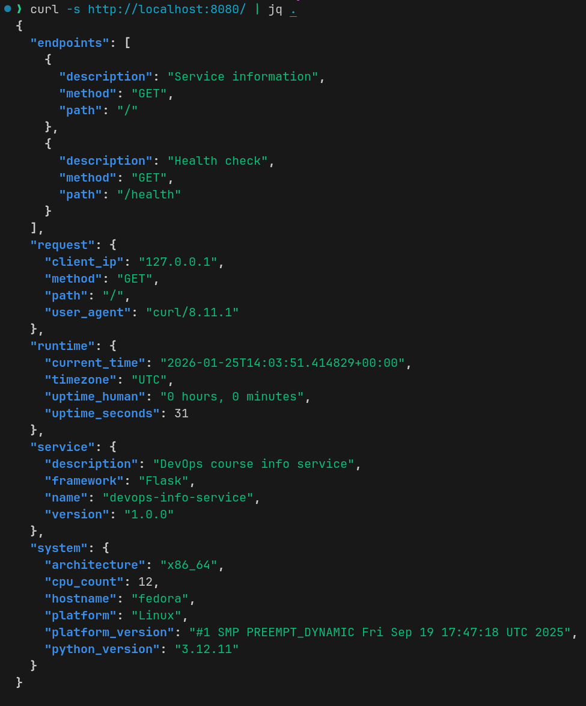
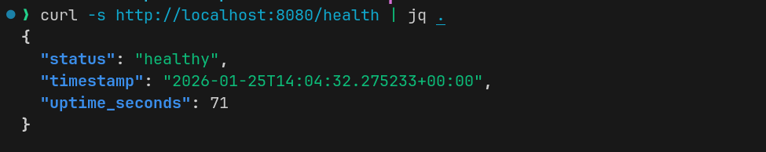
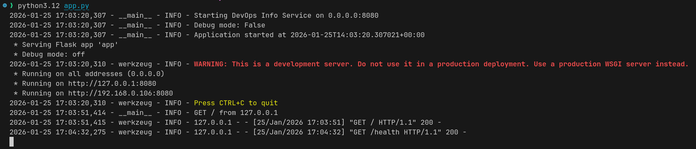

# Lab 1 Submission

## 1. Framework Selection

Chose **Flask** for simplicity and ease of learning. Compared to FastAPI (async but more complex) and Django (full-featured but heavy), Flask provides the right balance for a small DevOps service that needs to evolve gradually.

## 2. Best Practices Applied

- **Clean code**: PEP 8 compliance, clear function separation
- **Error handling**: Custom JSON error responses for 404/500
- **Logging**: Configurable logging with timestamps and levels
- **Configuration**: Environment variables for HOST, PORT, DEBUG
- **Documentation**: Complete docstrings and README

## 3. API Documentation

### `GET /`

Returns service and system info. Example:

```bash
curl http://localhost:5000/
```

### `GET /health`

Health check for monitoring. Example:

```bash
curl http://localhost:8080/health
```

## 4. Testing Evidence

### Main endpoint:



```bash
curl -s http://localhost:8080/ | jq '.service, .system.hostname'
```

### Health check:



```bash
curl -s http://localhost:8080/health
```

### App Logs:



### Environment variables:

```bash
PORT=5000 python app.py  # Custom port works
```

## 5. Challenges & Solutions

1. **Uptime format**: Implemented seconds-to-human-readable conversion
2. **JSON serialization**: Converted datetime objects to ISO strings
3. **Error handling**: Created custom JSON error responses
