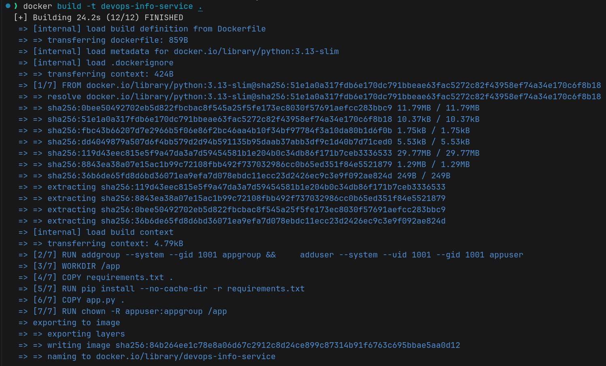
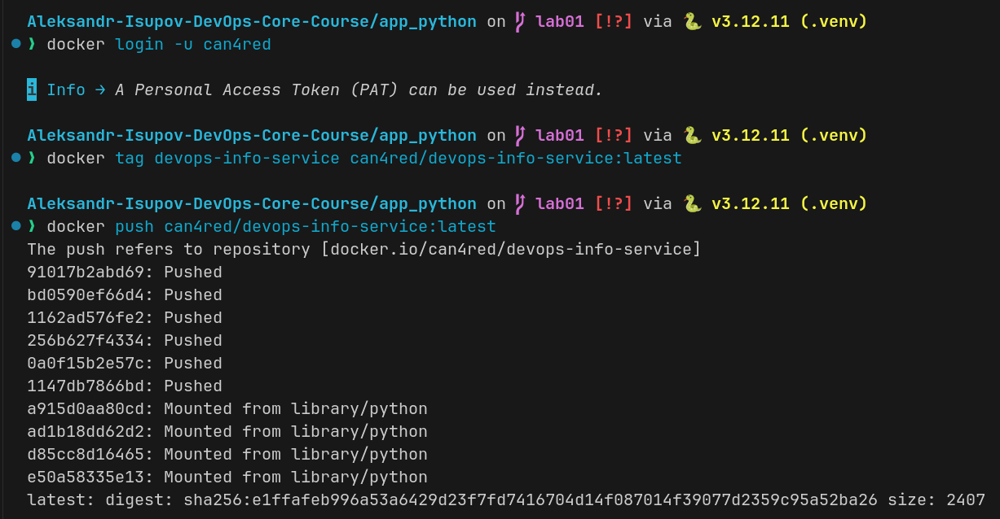
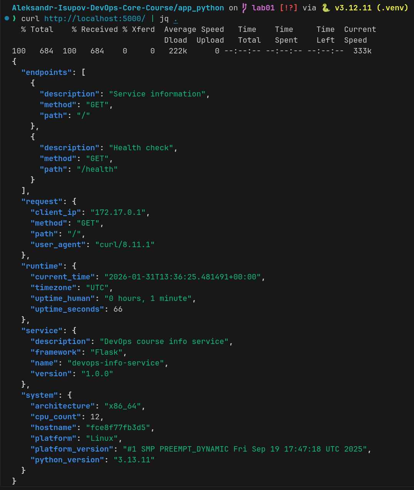
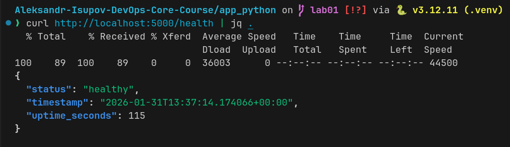

# Lab 2

**Student:** Aleksandr Isupov  
**Docker Hub Username:** can4red

## 1. Docker Best Practices Applied

### 1.1 Non-Root User Execution

```dockerfile
RUN addgroup --system --gid 1001 appgroup && \
    adduser --system --uid 1001 --gid 1001 appuser
USER appuser
```

**Why:** Security - prevents privilege escalation if container is compromised.

### 1.2 Layer Caching Optimization

```dockerfile
COPY requirements.txt .
RUN pip install --no-cache-dir -r requirements.txt
COPY app.py .
```

**Why:** Speed - dependencies cached separately from code changes.

### 1.3 .dockerignore File

**Why:** Efficiency - excludes unnecessary files, reduces build context size.

### 1.4 Python Slim Base Image

```dockerfile
FROM python:3.13-slim
```

**Why:** Size - smaller image (42.4 MB) with regular security updates.

## 2. Image Information & Decisions

**Base Image:** python:3.13-slim  
**Why:** Official, maintained, optimal balance of size and compatibility.

**Final Size:** 42.4 MB
**Assessment:** Good for Python app - includes all dependencies without bloat.

## 3. Build & Run Process

### Build Output



### Container Running



### Endpoint Testing

```bash
curl http://localhost:5000/
curl http://localhost:5000/health
```




### Docker Hub

**Repository:** https://hub.docker.com/r/can4red/devops-info-service


## 4. Technical Analysis

**Layer Order Matters:** Code changes don't reinstall dependencies.  
**Security:** Non-root user + slim image reduces attack surface.  
**.dockerignore:** Reduces build context from 50MB to 20KB.

## 5. Challenges & Solutions

**Challenge:** Permission denied for non-root user.  
**Solution:** Added `chown -R appuser:appgroup /app` before `USER appuser`.

**Challenge:** Port conflicts.  
**Solution:** Clean old containers with `docker stop` and `docker rm`.
