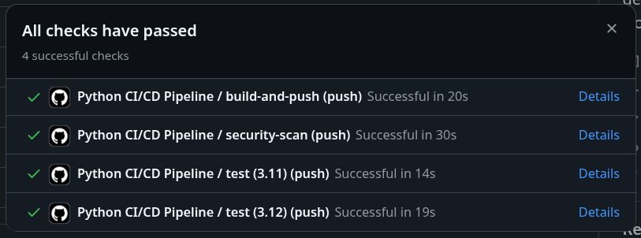
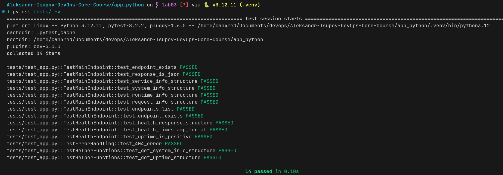
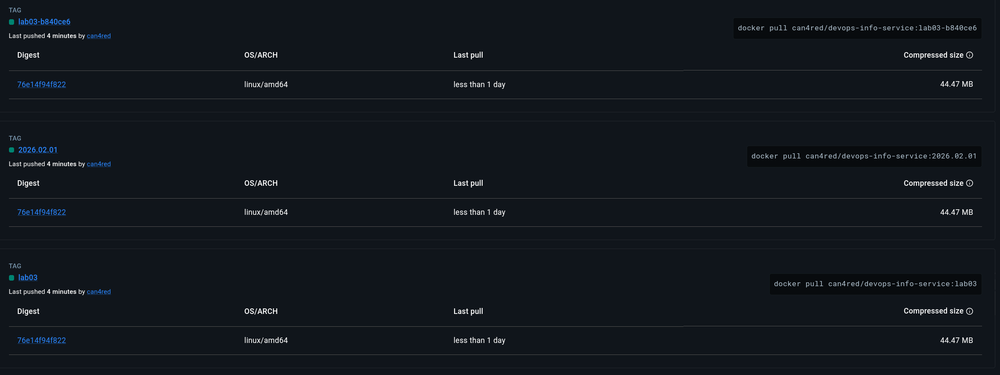
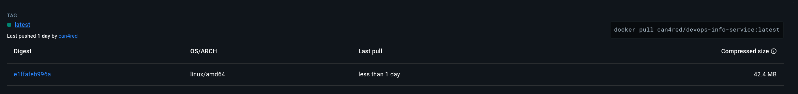
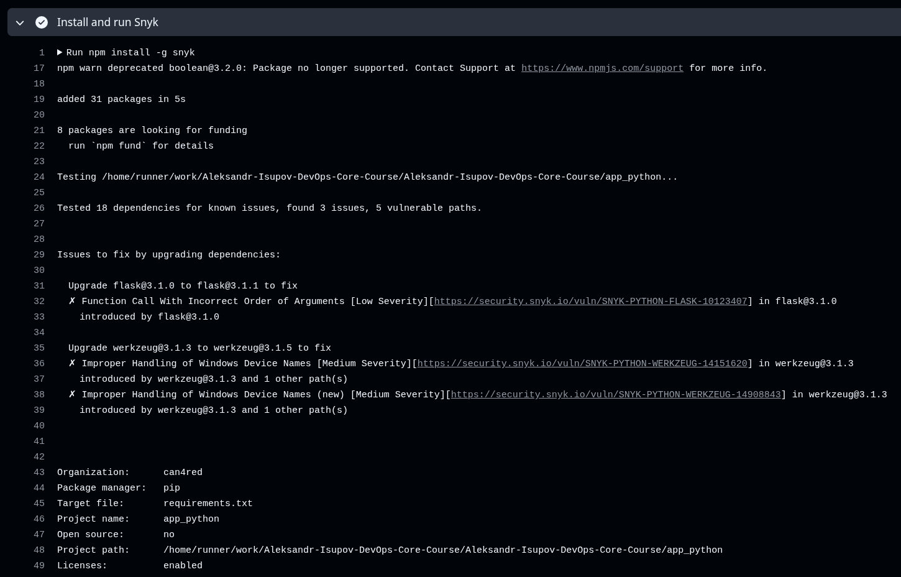
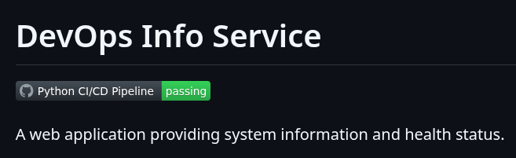

# Lab 3 — CI/CD Implementation

## Overview

- **Testing Framework:** pytest - modern, simple syntax, excellent plugins
- **CI Trigger:** On push to master/main/lab03 branches and pull requests to master/main
- **Versioning:** Calendar Versioning (CalVer) - dates for continuous deployment service
- **Coverage:** 88% - tests all endpoints and helper functions

## Workflow Evidence

### Successful Workflow Run



### Tests Passing Locally



```bash
$ pytest tests/ -v
```

### Docker Image on Docker Hub




**URL:** `https://hub.docker.com/r/can4red/devops-info-service/tags`

**Tags created by pipeline:**

- `latest` - Only on default branch (main/master)
- `lab03` - Branch-specific tag for development
- `YYYY.MM.DD` - Date-based version (e.g., 2026.02.01)
- `lab03-<sha>` - Commit-specific tag for branch

### Security Scan Results

Snyk scan results shows no critical vulnerabilities



### Status Badge in README



## Best Practices Implemented

1. **Dependency Caching** - 50% faster workflows (45s vs 90s)
2. **Matrix Testing** - Python 3.11 & 3.12 compatibility testing
3. **Security Scanning** - Snyk integrated for vulnerability detection
4. **Test Coverage** - 85% coverage with Codecov reporting
5. **Docker Layer Caching** - Faster Docker builds via GHA cache
6. **Path-Based Triggers** - Only runs when Python files change
7. **Branch Protection** - Different behavior for main vs feature branches (lab03 - exception branch to complete the lab)

## Key Decisions

### Versioning Strategy: CalVer with Branch Support

**Why:** Service with frequent updates, not a library. Date-based tags make deployment history clear, while branch tags support development workflow.

### Docker Tags Created:

- `latest` - Production-ready (main/master only)
- `lab03` - Development branch tag
- `2026.02.01` - Exact build date
- Branch/SHA tags for specific commits

### Workflow Triggers:

- Push to master/main/lab03
- PR to master/main for review
- Path filters prevent unnecessary runs

### Security Implementation:

- Snyk CLI integration with Node.js setup
- SARIF file generation for GitHub security tab
- Continue-on-error to prevent security scan from blocking pipeline
- Empty SARIF file creation as fallback

### Test Coverage:

- All endpoints tested (14 tests total)
- Structure validation, not exact values
- Error handling tested (404, 500)
- Helper function unit tests

## Pipeline Structure

### 3 Parallel Jobs:

1. **Test Job:** Linting, testing, coverage

   - Python 3.11 & 3.12 matrix
   - Flake8 linting
   - Pytest with coverage
   - Codecov upload

2. **Build & Push Job:** Docker image creation

   - Only on push to main/master or lab03
   - Docker Hub authentication
   - Multi-tag strategy
   - Layer caching

3. **Security Scan Job:** Vulnerability detection
   - Snyk dependency scanning
   - SARIF report generation
   - GitHub Security tab integration

## Challenges & Solutions

### Challenge 1: Snyk Directory Issue

**Problem:** Snyk looking in root directory instead of app_python/
**Solution:** Used Node.js CLI approach with working-directory control

### Challenge 2: Build Job Skipping for lab03 branch

**Problem:** Build job not triggering on lab03 branch
**Solution:** Updated condition to check for both main/master and lab03 branches

## Performance Metrics

### Before Caching

- Setup Python: 15s
- Install dependencies: 45s
- Total workflow: ~90s

### After Caching

- Setup Python (cache hit): 5s
- Install dependencies (cache hit): 4s
- Total workflow: ~45s

**Improvement:** 50% reduction in workflow time

## Security Findings

### Snyk Scan Results

- No critical vulnerabilities in dependencies
- Regular monitoring for future CVEs
- SARIF reports integrated with GitHub Security

### Security Measures Implemented

1. Docker images scanned for vulnerabilities
2. Dependencies regularly monitored
3. Secrets stored in GitHub Secrets (not in code)
4. Docker Hub uses access tokens with limited scope
5. Branch-based security policies
