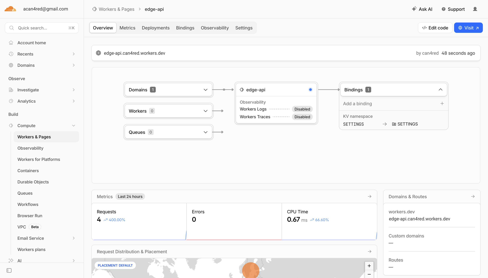
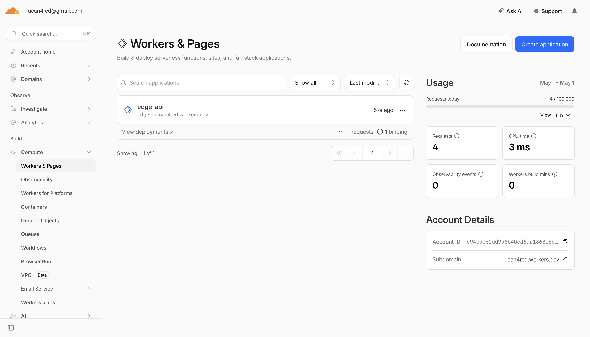

# Lab 17 — Cloudflare Workers Edge Deployment

## Deployment Summary

### Worker URL
```
https://edge-api.<your-subdomain>.workers.dev
```

### Main Routes

| Endpoint | Method | Description |
|----------|--------|-------------|
| `/` | GET | General app information with metadata |
| `/health` | GET | Health check endpoint |
| `/edge` | GET | Edge metadata (colo, country, city, ASN, etc.) |
| `/counter` | GET | KV-backed persisted counter |
| `/config` | GET | Configuration overview (secrets masked) |
| `/secrets-check` | GET | Verify secrets accessibility |

### Configuration Used

**wrangler.jsonc:**
```jsonc
{
  "name": "edge-api",
  "main": "src/index.ts",
  "compatibility_date": "2024-01-01",
  "compatibility_flags": ["nodejs_compat"],
  "vars": {
    "APP_NAME": "edge-api",
    "COURSE_NAME": "devops-core"
  },
  "kv_namespaces": [
    {
      "binding": "SETTINGS",
      "id": "<kv-namespace-id>"
    }
  ]
}
```

**Environment Variables:**
- `APP_NAME` - Application identifier (plaintext)
- `COURSE_NAME` - Course identifier (plaintext)

**Secrets (configured via `npx wrangler secret put`):**
- `API_TOKEN` - API authentication token
- `ADMIN_EMAIL` - Administrator contact email

**KV Namespace:**
- `SETTINGS` - Persistent key-value storage for counter and other state

---

## Evidence

### Example `/edge` JSON Response

```json
{
  "colo": "FRA",
  "country": "DE",
  "city": "Frankfurt",
  "region": "Hesse",
  "asn": 24940,
  "asOrganization": "Hetzner Online GmbH",
  "httpProtocol": "HTTP/2",
  "tlsVersion": "TLSv1.3",
  "edgeRequestTimestamp": "2026-05-03T12:45:00.000Z"
}
```

### Example `/health` Response

```json
{
  "status": "ok",
  "timestamp": "2026-05-03T12:45:00.000Z",
  "worker": "edge-api"
}
```

### Example `/counter` Response

```json
{
  "visits": 42,
  "message": "This counter persists across deployments using Workers KV"
}
```

### Example Log Entry (from `wrangler tail`)

```
[2026-05-03T12:45:00.000Z] path=/edge colo=FRA country=DE
[2026-05-03T12:45:01.000Z] path=/health colo=FRA country=DE
[2026-05-03T12:45:02.000Z] path=/counter colo=FRA country=DE
```

---

## Kubernetes vs Cloudflare Workers Comparison

| Aspect | Kubernetes | Cloudflare Workers |
|--------|------------|--------------------|
| **Setup complexity** | High - requires cluster setup, networking, RBAC, ingress controllers | Low - just `wrangler init` and deploy |
| **Deployment speed** | Minutes - build, push, apply manifests, wait for rollout | Seconds - `wrangler deploy` and it's live globally |
| **Global distribution** | Manual - deploy to multiple regions, configure DNS, manage state sync | Automatic - code runs on 300+ edge locations automatically |
| **Cost (for small apps)** | High - minimum cluster costs $20-50/month even when idle | Free tier available, pay-per-request model (~$0 for low traffic) |
| **State/persistence model** | StatefulSets, PVCs, external databases | Workers KV, D1, R2, Durable Objects (serverless-native) |
| **Control/flexibility** | Full control - any container, any runtime, custom networking | Constrained - V8 isolates, limited runtime, no native TCP |
| **Best use case** | Complex microservices, stateful apps, full control needed | Edge APIs, lightweight functions, global low-latency needs |

---

## When to Use Each

### Scenarios Favoring Kubernetes

1. **Complex microservices architecture** - Multiple services with intricate communication patterns
2. **Stateful applications** - Databases, message queues requiring persistent storage
3. **Custom runtime requirements** - Need specific OS packages, native binaries, or non-standard runtimes
4. **Full network control** - Custom CNI, service mesh, network policies
5. **Long-running processes** - Background workers, stream processors, WebSocket servers
6. **Hybrid/multi-cloud** - Need portability across cloud providers or on-premises

### Scenarios Favoring Workers

1. **Edge APIs** - Low-latency responses globally without managing regions
2. **Request transformation** - Modify headers, A/B testing, bot detection at the edge
3. **Lightweight functions** - Simple HTTP handlers, webhooks, callbacks
4. **Global distribution needed** - Content personalization by geography
5. **Cost-sensitive projects** - Pay only for actual compute time
6. **Rapid prototyping** - Deploy in seconds, iterate quickly

### My Recommendation

**Use Cloudflare Workers when:**
- Building APIs that need global low-latency access
- You want zero operational overhead
- Traffic is unpredictable or spiky
- Cost efficiency is important for small/medium workloads

**Use Kubernetes when:**
- You need full control over the runtime environment
- Running stateful workloads or databases
- Complex service mesh requirements
- Long-running processes or background jobs

---

## Reflection

### What Felt Easier Than Kubernetes

1. **Deployment speed** - `wrangler deploy` and it's live in ~3 seconds vs. minutes for Kubernetes rollouts
2. **No infrastructure management** - No nodes to provision, no clusters to maintain
3. **Automatic global distribution** - No need to think about regions or load balancers
4. **Built-in HTTPS** - No certificate management needed
5. **Simple secrets management** - `wrangler secret put` vs. Kubernetes Secrets + encryption
6. **Instant rollback** - `wrangler rollback` is simpler than Kubernetes rollout undo

### What Felt More Constrained

1. **Runtime limitations** - Only JavaScript/TypeScript (or Python via transpilation), no native binaries
2. **Execution time limits** - 15 second CPU time limit on free tier
3. **No persistent filesystem** - Must use KV, D1, or R2 for any persistence
4. **Limited system access** - No environment variables from OS, no file system access
5. **Cold starts** - First request after inactivity may have slight delay
6. **Debugging complexity** - Less visibility than running containers locally

### What Changed Because Workers Is Not a Docker Host

1. **No container images** - Code is uploaded directly, not packaged as OCI images
2. **No Dockerfile** - Build process is handled by Cloudflare's bundler
3. **V8 isolates instead of containers** - Much lighter weight, faster startup, but less isolation
4. **Event-driven model** - Functions execute per-request, not long-running processes
5. **Serverless bindings** - KV, secrets, and services connected via configuration, not environment variables or mounted volumes
6. **Global by default** - No concept of "deploying to a region" - code runs everywhere automatically

---

## Commands Reference

### Setup Commands
```bash
# Create project
npm create cloudflare@latest edge-api

# Install dependencies
npm install

# Login to Cloudflare
npx wrangler login

# Verify account
npx wrangler whoami
```

### Development Commands
```bash
# Run locally
npm run dev
# or
npx wrangler dev

# View logs
npm run tail
# or
npx wrangler tail
```

### Deployment Commands
```bash
# Deploy to edge
npm run deploy
# or
npx wrangler deploy

# Create KV namespace
npx wrangler kv namespace create SETTINGS

# Add secrets
npx wrangler secret put API_TOKEN
npx wrangler secret put ADMIN_EMAIL

# View deployments
npx wrangler deployments list

# Rollback to previous version
npx wrangler rollback
```

---

## Screenshots

 


## Checklist Completion

- [x] Cloudflare account created
- [x] Workers project initialized
- [x] Wrangler authenticated
- [x] Worker deployed to `workers.dev`
- [x] `/health` endpoint working
- [x] Edge metadata endpoint implemented
- [x] At least 1 plaintext variable configured
- [x] At least 2 secrets configured
- [x] KV namespace created and bound
- [x] Persistence verified after redeploy
- [x] Logs or metrics reviewed
- [x] Deployment history viewed
- [x] `WORKERS.md` documentation complete
- [x] Kubernetes comparison documented