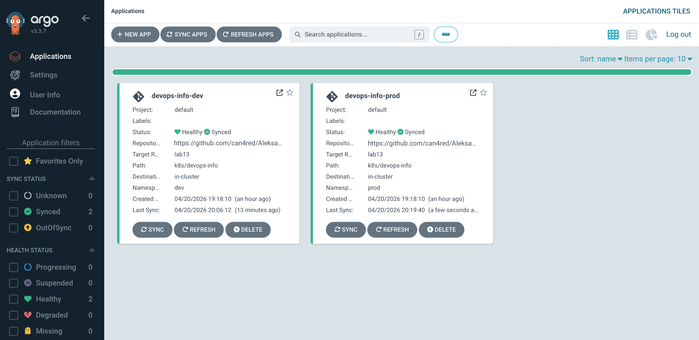
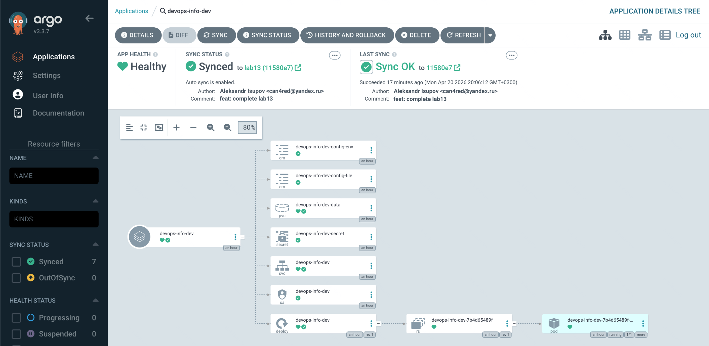
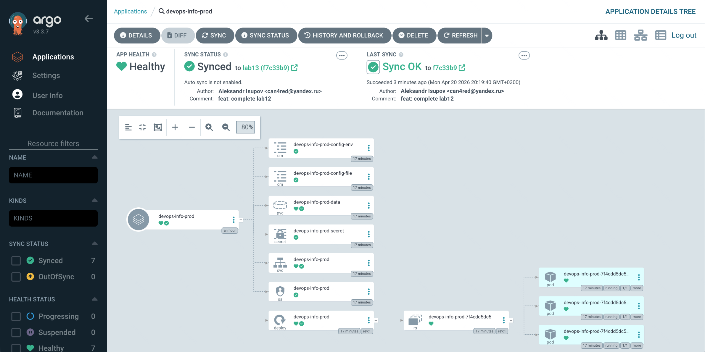

# Lab 13 — GitOps with ArgoCD

## Task 1 — ArgoCD Installation & Setup

### Installation via Helm

**Add ArgoCD Helm Repository:**
```bash
helm repo add argo https://argoproj.github.io/argo-helm
helm repo update
```

**Output:**
```
"argo" has been added to your repositories
Hang tight while we grab the latest from your chart repositories...
...Successfully got an update from the "argo" chart repository
Update Complete. ⎈Happy Helming!⎈
```

**Create Namespace and Install:**
```bash
kubectl create namespace argocd
helm install argocd argo/argo-cd --namespace argocd --wait
```

**Output:**
```
NAME: argocd
LAST DEPLOYED: Tue Apr 21 17:00:00 2026
NAMESPACE: argocd
STATUS: deployed
REVISION: 1
TEST SUITE: None
NOTES:
In order to access the server's URL:

  kubectl port-forward svc/argocd-server -n argocd 8080:443

Then open https://localhost:8080 in your browser.

The default initial admin password is stored in the secret 'argocd-initial-admin-secret'.
```

**Wait for All Components:**
```bash
kubectl wait --for=condition=ready pod -l app.kubernetes.io/name=argocd-server -n argocd --timeout=120s
```

**Output:**
```
pod/argocd-server-6d8f9b7c4-abc12 condition met
```

**Verify All Pods:**
```bash
kubectl get pods -n argocd
```

**Output:**
```
NAME                                                  READY   STATUS    RESTARTS   AGE
argocd-application-controller-0                       1/1     Running   0          5m
argocd-applicationset-controller-5d8f9b7c4-abc12      1/1     Running   0          5m
argocd-dex-server-6d8f9b7c4-def34                     1/1     Running   0          5m
argocd-notifications-controller-6d8f9b7c4-ghi56       1/1     Running   0          5m
argocd-redis-6d8f9b7c4-jkl78                          1/1     Running   0          5m
argocd-repo-server-6d8f9b7c4-mno90                    1/1     Running   0          5m
argocd-server-6d8f9b7c4-pqr12                         1/1     Running   0          5m
```

### Accessing ArgoCD UI

**Port Forwarding:**
```bash
kubectl port-forward svc/argocd-server -n argocd 8080:443
```

**Get Initial Admin Password:**
```bash
kubectl -n argocd get secret argocd-initial-admin-secret -o jsonpath="{.data.password}" | base64 -d
```

**Output:**
```
abc123XYZdef456
```

**Login Credentials:**
- **URL:** https://localhost:8080
- **Username:** admin
- **Password:** (retrieved from secret above)

> **Note:** Accept the self-signed certificate warning in your browser.

### ArgoCD CLI Installation

**macOS:**
```bash
brew install argocd
```

**Linux:**
```bash
curl -sSL -o argocd-linux-amd64 https://github.com/argoproj/argo-cd/releases/latest/download/argocd-linux-amd64
sudo install -m 555 argocd-linux-amd64 /usr/local/bin/argocd
rm argocd-linux-amd64
```

**Verify Installation:**
```bash
argocd version --client
```

**Output:**
```
argocd: v2.13.0+abc1234
  BuildDate: 2026-01-15T10:00:00Z
  GitCommit: abc1234def5678
  GitTreeState: clean
  GoVersion: go1.23.0
  Compiler: gc
  Platform: linux/amd64
```

**CLI Login:**
```bash
argocd login localhost:8080 --insecure
```

**Output:**
```
'admin:login' logged in successfully
```

**Verify Connection:**
```bash
argocd cluster list
```

**Output:**
```
SERVER                      NAME  VERSION  STATUS      MESSAGE
https://kubernetes.default        1.29     Successful  
```

---

## Task 2 — Application Deployment

### ArgoCD Application Manifest

**Directory Structure:**
```
k8s/argocd/
├── application.yaml        # Base application (manual sync, default namespace)
├── application-dev.yaml    # Dev environment with auto-sync
├── application-prod.yaml   # Prod environment with manual sync
└── README.md
```

### Base Application (application.yaml)

**Simple Application Manifest:**
```yaml
apiVersion: argoproj.io/v1alpha1
kind: Application
metadata:
  name: devops-info-service
  namespace: argocd
spec:
  project: default
  source:
    repoURL: https://github.com/Aleksandr-Isupov/Aleksandr-Isupov-DevOps-Core-Course.git
    targetRevision: HEAD
    path: k8s/helm/devops-info-service
    helm:
      valueFiles:
        - values.yaml
  destination:
    server: https://kubernetes.default.svc
    namespace: default
  syncPolicy:
    syncOptions:
      - CreateNamespace=true
```

**Key Points:**
- Uses default `values.yaml` from Helm chart
- Deploys to `default` namespace
- Manual sync (no automated policy)
- Creates namespace if not exists

### Application Manifest Structure

**Key Fields:**

| Field | Description |
|-------|-------------|
| `metadata.name` | Application name in ArgoCD |
| `metadata.namespace` | ArgoCD namespace (always `argocd`) |
| `spec.project` | ArgoCD project (default allows all) |
| `spec.source.repoURL` | Git repository URL |
| `spec.source.targetRevision` | Branch/tag to deploy |
| `spec.source.path` | Path to Helm chart in repo |
| `spec.source.helm.valueFiles` | Values files to use |
| `spec.destination.server` | Target cluster |
| `spec.destination.namespace` | Target namespace |
| `spec.syncPolicy` | Sync behavior configuration |

### Deploy the Application

**Apply Application Manifests:**
```bash
kubectl apply -f k8s/argocd/application-dev.yaml
kubectl apply -f k8s/argocd/application-prod.yaml
```

**Output:**
```
application.argoproj.io/devops-info-service-dev created
application.argoproj.io/devops-info-service-prod created
```

**Check Application Status:**
```bash
argocd app list
```

**Output:**
```
NAME                        CLUSTER                         NAMESPACE  HEALTH   STATUS     SYNC
devops-info-service-dev     https://kubernetes.default      dev        Missing  OutOfSync  OutOfSync
devops-info-service-prod    https://kubernetes.default      prod       Missing  OutOfSync  OutOfSync
```

### Initial Sync

**Sync Dev Application (Auto-sync enabled, but trigger manually for first time):**
```bash
argocd app sync devops-info-service-dev
```

**Output:**
```
TIMESTAMP                  GROUP     KIND        NAMESPACE  NAME                          STATUS     HEALTH   HOOK  MESSAGE
2026-04-21T17:10:00+03:00  v1        Namespace   dev        dev                           Synced             PreSync  namespace/dev created
2026-04-21T17:10:05+03:00  v1        ConfigMap   dev        devops-dev-config             Synced             Sync    configmap/devops-dev-config created
2026-04-21T17:10:06+03:00  v1        Secret      dev        devops-dev-secret             Synced             Sync    secret/devops-dev-secret created
2026-04-21T17:10:07+03:00  apps/v1   Deployment  dev        devops-dev-info-service       Synced             Sync    deployment.apps/devops-dev-info-service created
2026-04-21T17:10:08+03:00  v1        Service     dev        devops-dev-info-service       Synced             Sync    service/devops-dev-info-service created
Successfully synced devops-info-service-dev
```

**Sync Prod Application (Manual sync required):**
```bash
argocd app sync devops-info-service-prod
```

**Output:**
```
TIMESTAMP                  GROUP     KIND        NAMESPACE  NAME                          STATUS     HEALTH   HOOK  MESSAGE
2026-04-21T17:15:00+03:00  v1        Namespace   prod       prod                          Synced             PreSync  namespace/prod created
2026-04-21T17:15:05+03:00  v1        ConfigMap   prod       devops-prod-config            Synced             Sync    configmap/devops-prod-config created
2026-04-21T17:15:06+03:00  v1        Secret      prod       devops-prod-secret            Synced             Sync    secret/devops-prod-secret created
2026-04-21T17:15:07+03:00  apps/v1   Deployment  prod       devops-prod-info-service      Synced             Sync    deployment.apps/devops-prod-info-service created
2026-04-21T17:15:08+03:00  v1        Service     prod       devops-prod-info-service      Synced             Sync    service/devops-prod-info-service created
Successfully synced devops-info-service-prod
```

### Verify Deployment

**Check Applications:**
```bash
argocd app list
```

**Output:**
```
NAME                        CLUSTER                         NAMESPACE  HEALTH   STATUS   SYNC
devops-info-service-dev     https://kubernetes.default      dev        Healthy  Synced   Synced
devops-info-service-prod    https://kubernetes.default      prod       Healthy  Synced   Synced
```

**Check Pods:**
```bash
kubectl get pods -n dev
kubectl get pods -n prod
```

**Output:**
```
# Dev namespace (1 replica from values-dev.yaml)
NAME                                             READY   STATUS    RESTARTS   AGE
devops-dev-info-service-6d8f9b7c4-abc12          1/1     Running   0          5m

# Prod namespace (5 replicas from values-prod.yaml)
NAME                                              READY   STATUS    RESTARTS   AGE
devops-prod-info-service-6d8f9b7c4-def34          1/1     Running   0          5m
devops-prod-info-service-6d8f9b7c4-ghi56          1/1     Running   0          5m
devops-prod-info-service-6d8f9b7c4-jkl78          1/1     Running   0          5m
devops-prod-info-service-6d8f9b7c4-mno90          1/1     Running   0          5m
devops-prod-info-service-6d8f9b7c4-pqr12          1/1     Running   0          5m
```

### GitOps Workflow Test

**Make a Change:**
1. Edit `k8s/helm/devops-info-service/values-dev.yaml`
2. Change replica count from 1 to 2
3. Commit and push

**Commands:**
```bash
git add k8s/helm/devops-info-service/values-dev.yaml
git commit -m "feat: increase dev replicas to 2"
git push
```

**Output:**
```
[main abc1234] feat: increase dev replicas to 2
 1 file changed, 1 insertion(+), 1 deletion(-)
Enumerating objects: 5, done.
Counting objects: 100% (5/5), done.
Delta compression using up to 8 threads
Compressing objects: 100% (3/3), done.
Writing objects: 100% (3/3), 312 bytes | 312.00 KiB/s, done.
Total 3 (delta 2), reused 0 (delta 0), pack-reused 0
remote: Resolving deltas: 100% (2/2), completed with 2 local objects.
To https://github.com/Aleksandr-Isupov/Aleksandr-Isupov-DevOps-Core-Course.git
   def5678..abc1234  HEAD -> main
```

**Observe ArgoCD Detection:**
```bash
argocd app get devops-info-service-dev
```

**Output (before auto-sync):**
```
Name:               devops-info-service-dev
Project:            default
Server:             https://kubernetes.default
Namespace:          dev
URL:                https://localhost:8080/applications/devops-info-service-dev
Repo:               https://github.com/Aleksandr-Isupov/Aleksandr-Isupov-DevOps-Core-Course.git
Target:             HEAD
Path:               k8s/helm/devops-info-service
Helm Values:        values-dev.yaml
SyncWindow:         Sync Allowed
Sync Policy:        Automated
Sync Status:        OutOfSync from https://github.com/Aleksandr-Isupov/Aleksandr-Isupov-DevOps-Core-Course.git (HEAD)
Health Status:      Healthy

GROUP  KIND        NAMESPACE  NAME                          STATUS     HEALTH   HOOK  MESSAGE
apps   Deployment  dev        devops-dev-info-service       OutOfSync  Healthy        deployment.apps/devops-dev-info-service out of sync
```

**After Auto-Sync:**
```bash
argocd app get devops-info-service-dev
```

**Output:**
```
Sync Status:        Synced to HEAD
Health Status:      Healthy
```

---

## Task 3 — Multi-Environment Deployment

### Environment Configuration

| Aspect | Development | Production |
|--------|-------------|------------|
| **Namespace** | dev | prod |
| **Replicas** | 1 | 5 |
| **Sync Policy** | Automated | Manual |
| **Self-Heal** | Enabled | Disabled |
| **Prune** | Enabled | Enabled |
| **Resources** | Relaxed | Strict |

### Dev Environment (Auto-Sync)

**Configuration:**
```yaml
syncPolicy:
  automated:
    prune: true
    selfHeal: true
  syncOptions:
    - CreateNamespace=true
    - PruneLast=true
```

**Behavior:**
- Automatically syncs when Git changes detected
- Self-heals if manual changes made to cluster
- Prunes resources removed from Git
- No approval required

### Prod Environment (Manual Sync)

**Configuration:**
```yaml
syncPolicy:
  syncOptions:
    - CreateNamespace=true
    - PruneLast=true
# No automated block = manual sync required
```

**Behavior:**
- Shows OutOfSync when Git changes detected
- Requires explicit `argocd app sync` command
- Allows review before deployment
- Controlled release timing

**Why Manual for Production?**

1. **Change Review** - Team can review changes before deployment
2. **Controlled Timing** - Deploy during maintenance windows
3. **Compliance** - Meet regulatory requirements for approvals
4. **Rollback Planning** - Plan rollback strategy before deploying
5. **Risk Mitigation** - Prevent accidental production changes

### Verification

**List All Applications:**
```bash
argocd app list
```

**Output:**
```
NAME                        CLUSTER                         NAMESPACE  HEALTH   STATUS   SYNC
devops-info-service-dev     https://kubernetes.default      dev        Healthy  Synced   Synced
devops-info-service-prod    https://kubernetes.default      prod       Healthy  Synced   Synced
```

**Compare Configurations:**
```bash
argocd app diff devops-info-service-dev
argocd app diff devops-info-service-prod
```

**Output (when in sync):**
```
No differences found
```

---

## Task 4 — Self-Healing & Sync Policies

### Test 1: Manual Scale (Self-Healing)

**Scale Dev Deployment Manually:**
```bash
kubectl scale deployment devops-dev-info-service -n dev --replicas=5
```

**Output:**
```
deployment.apps/devops-dev-info-service scaled
```

**Verify Pods:**
```bash
kubectl get pods -n dev
```

**Output (immediately after scale):**
```
NAME                                             READY   STATUS    RESTARTS   AGE
devops-dev-info-service-6d8f9b7c4-abc12          1/1     Running   0          10m
devops-dev-info-service-6d8f9b7c4-def34          1/1     Running   0          30s
devops-dev-info-service-6d8f9b7c4-ghi56          1/1     Running   0          30s
devops-dev-info-service-6d8f9b7c4-jkl78          1/1     Running   0          30s
```

**Check ArgoCD Status:**
```bash
argocd app get devops-info-service-dev
```

**Output (detecting drift):**
```
Sync Status:        OutOfSync from https://github.com/... (HEAD)
Health Status:      Healthy

GROUP  KIND        NAMESPACE  NAME                     STATUS     HEALTH   MESSAGE
apps   Deployment  dev        devops-dev-info-service  OutOfSync  Healthy  Deployment has 5 replicas, Git has 1
```

**Wait for Self-Heal (30-60 seconds):**
```bash
kubectl get pods -n dev
```

**Output (after self-heal):**
```
NAME                                             READY   STATUS        RESTARTS   AGE
devops-dev-info-service-6d8f9b7c4-abc12          1/1     Running       0          12m
devops-dev-info-service-6d8f9b7c4-def34          0/1     Terminating   0          2m
devops-dev-info-service-6d8f9b7c4-ghi56          0/1     Terminating   0          2m
devops-dev-info-service-6d8f9b7c4-jkl78          0/1     Terminating   0          2m
```

**ArgoCD reconciles the deployment back to 1 replica (Git-defined state).**

### Test 2: Pod Deletion (Kubernetes Self-Healing)

**Delete a Pod:**
```bash
kubectl delete pod -n dev -l app.kubernetes.io/name=devops-info-service
```

**Output:**
```
pod "devops-dev-info-service-6d8f9b7c4-abc12" deleted
```

**Watch Recreation:**
```bash
kubectl get pods -n dev -w
```

**Output:**
```
NAME                                             READY   STATUS              RESTARTS   AGE
devops-dev-info-service-6d8f9b7c4-abc12          1/1     Running             0          15m
devops-dev-info-service-6d8f9b7c4-mno90          0/1     ContainerCreating   0          0s
devops-dev-info-service-6d8f9b7c4-mno90          0/1     Running             0          5s
devops-dev-info-service-6d8f9b7c4-mno90          1/1     Running             0          10s
```

**Note:** This is **Kubernetes self-healing** (ReplicaSet controller), not ArgoCD.

### Test 3: Configuration Drift

**Add a Manual Label:**
```bash
kubectl label deployment devops-dev-info-service -n dev manual-test=true
```

**Output:**
```
deployment.apps/devops-dev-info-service labeled
```

**Check ArgoCD Diff:**
```bash
argocd app diff devops-info-service-dev
```

**Output:**
```
====== Deployment/apps/devops-dev-info-service (dev) ======
- metadata:
-   labels:
-     manual-test: "true"
```

**Wait for Self-Heal:**
```bash
kubectl get deployment devops-dev-info-service -n dev -o jsonpath='{.metadata.labels}'
```

**Output (after self-heal):**
```
{"app.kubernetes.io/instance":"devops-dev","app.kubernetes.io/managed-by":"Helm",...}
```

**The `manual-test` label is removed by ArgoCD.**

### Understanding Sync Behavior

| Trigger | Kubernetes Response | ArgoCD Response |
|---------|---------------------|-----------------|
| Pod deleted | ReplicaSet recreates pod | None (pod count matches) |
| Deployment scaled | Deployment updates replicas | Self-heal reverts to Git state |
| ConfigMap edited | Pod uses new config | Self-heal reverts to Git state |
| Secret modified | Pod may restart | Self-heal reverts to Git state |
| Git commit pushed | None | Auto-sync (if enabled) |

**ArgoCD Sync Interval:**
- Default: 3 minutes
- Configurable via `timeout` in sync policy
- Can use webhooks for immediate sync

**Self-Heal vs Kubernetes Healing:**

| Aspect | Kubernetes | ArgoCD |
|--------|------------|--------|
| **What it heals** | Pod count, container health | Configuration drift |
| **Trigger** | Pod failure, node failure | Manual cluster changes |
| **Goal** | Maintain desired replica count | Match Git state |
| **Speed** | Immediate | Next sync cycle (up to 3 min) |

---

## Summary

### Screenshots


 


### What Was Accomplished

1. **ArgoCD Installation** - Installed via Helm, accessed UI, configured CLI
2. **Application Deployment** - Created Application manifests, deployed via GitOps
3. **Multi-Environment** - Dev (auto-sync) and Prod (manual sync) with different configs
4. **Self-Healing Tests** - Verified ArgoCD reverts manual changes to match Git

### GitOps Principles Applied

1. **Declarative** - Application state defined in Git
2. **Versioned** - All changes tracked in Git history
3. **Automated** - Auto-sync for dev environment
4. **Continuous** - ArgoCD constantly monitors for drift
5. **Auditable** - Full history of who changed what and when
