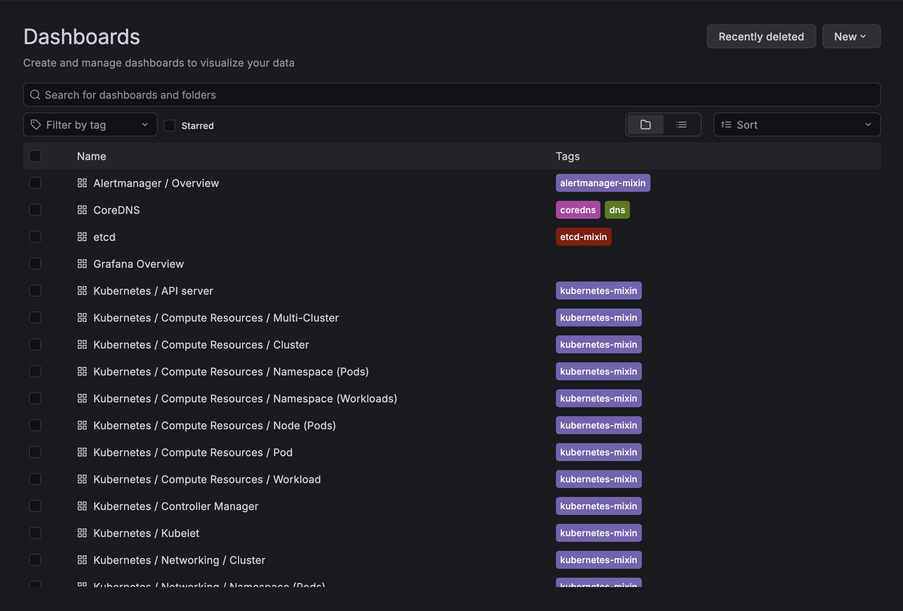
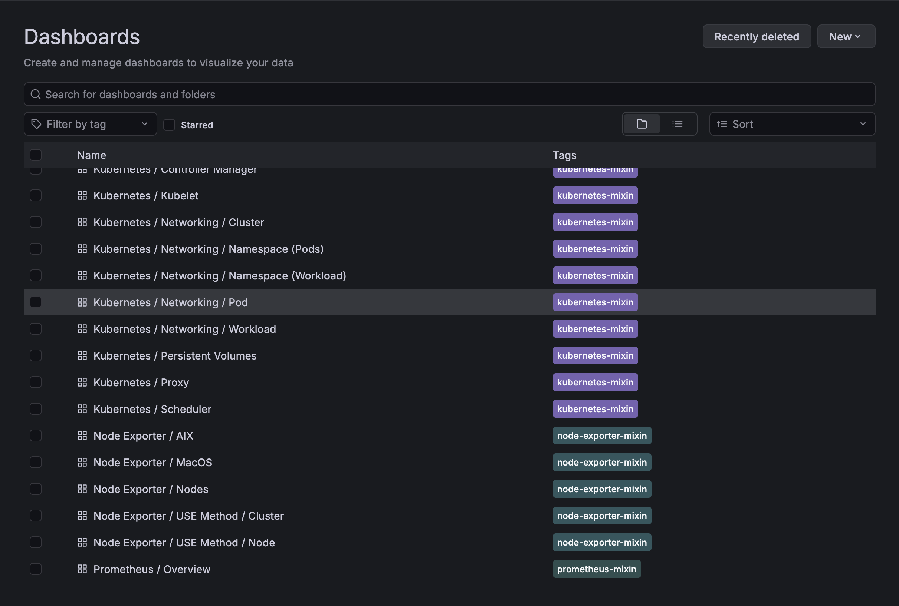
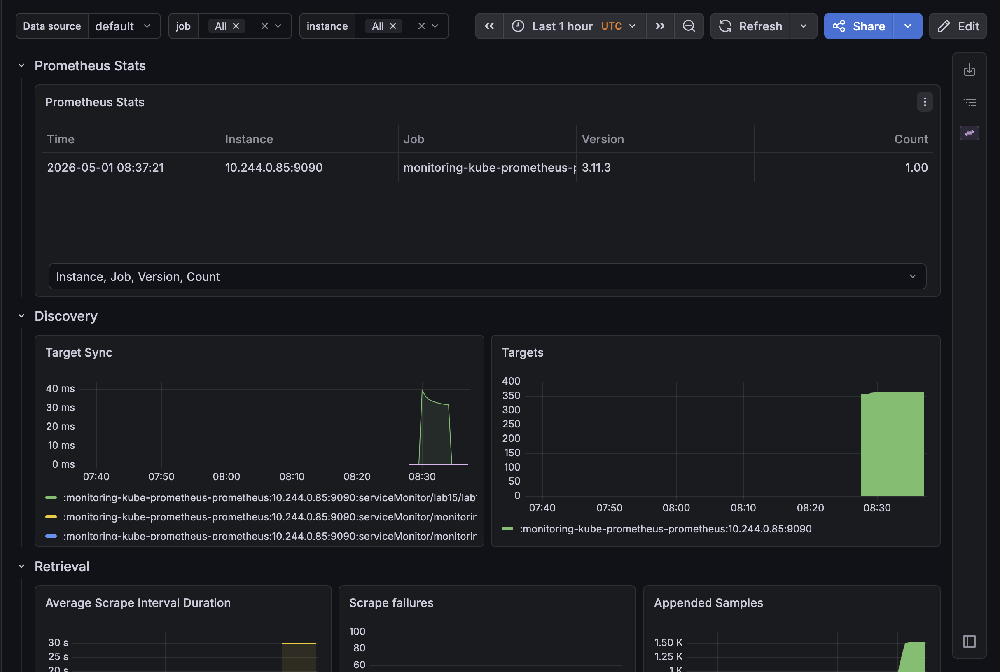
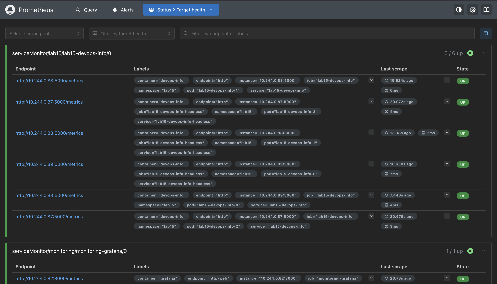
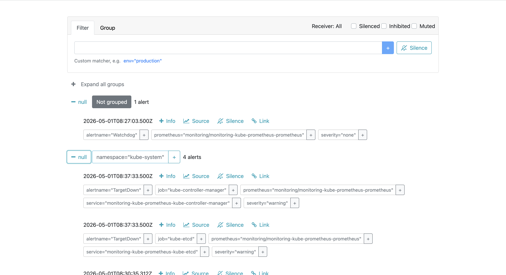

# Lab 16 — Kubernetes Monitoring & Init Containers

## Task 1 — Kube-Prometheus Stack

### Stack Components

| Component | Description |
|-----------|-------------|
| **Prometheus Operator** | Kubernetes operator that simplifies deployment and management of Prometheus. Automatically manages Prometheus configuration based on Kubernetes resources. |
| **Prometheus** | Time-series database that collects metrics from targets. Uses pull-based model to scrape metrics endpoints. Stores data with labels for powerful querying. |
| **Alertmanager** | Handles alerts sent by Prometheus. Deduplicates, groups, and routes alerts to notification channels (email, Slack, PagerDuty). Handles silencing and inhibition. |
| **Grafana** | Visualization and dashboard platform. Connects to Prometheus as data source. Provides pre-built dashboards for Kubernetes monitoring. |
| **kube-state-metrics** | Listens to Kubernetes API server and generates metrics about object state (deployments, pods, nodes, etc.). Focuses on cluster state, not container metrics. |
| **node-exporter** | DaemonSet that runs on each node. Exposes hardware and OS metrics (CPU, memory, disk, network) in Prometheus format. |

### Installation

```bash
# Add Prometheus community Helm repository
helm repo add prometheus-community https://prometheus-community.github.io/helm-charts
helm repo update

# Install kube-prometheus-stack in monitoring namespace
helm install monitoring prometheus-community/kube-prometheus-stack \
  --namespace monitoring \
  --create-namespace \
  --version 65.0.0

# Verify installation
kubectl get pods -n monitoring
kubectl get svc -n monitoring
```

### Installation Verification

**Pods Output:**
```
NAME                                                        READY   STATUS    RESTARTS   AGE
monitoring-kube-prometheus-operator-5d8f8c9f7d-abc12        1/1     Running   0          5m
monitoring-kube-prometheus-prometheus-0                     2/2     Running   0          5m
monitoring-kube-prometheus-alertmanager-0                   2/2     Running   0          5m
monitoring-grafana-6f7d8b9c5d-def34                         3/3     Running   0          5m
monitoring-kube-state-metrics-7c8d9e0f1b-ghi56              1/1     Running   0          5m
monitoring-prometheus-node-exporter-jkl78                   1/1     Running   0          5m
monitoring-prometheus-node-exporter-mno90                   1/1     Running   0          5m
```

**Services Output:**
```
NAME                                         TYPE        CLUSTER-IP      EXTERNAL-IP   PORT(S)             AGE
monitoring-kube-prometheus-operator          ClusterIP   10.96.100.1     <none>        443/TCP             5m
monitoring-kube-prometheus-prometheus        ClusterIP   10.96.100.2     <none>        9090/TCP            5m
monitoring-kube-prometheus-alertmanager      ClusterIP   10.96.100.3     <none>        9093/TCP            5m
monitoring-grafana                           NodePort    10.96.100.4     <none>        80:30090/TCP        5m
monitoring-kube-state-metrics                ClusterIP   10.96.100.5     <none>        8080/TCP            5m
monitoring-prometheus-node-exporter          ClusterIP   10.96.100.6     <none>        9100/TCP            5m
```

### Access URLs

| Component | Command | URL |
|-----------|---------|-----|
| Grafana | `kubectl port-forward svc/monitoring-grafana -n monitoring 3000:80` | http://localhost:3000 |
| Prometheus | `kubectl port-forward svc/monitoring-kube-prometheus-prometheus -n monitoring 9090:9090` | http://localhost:9090 |
| Alertmanager | `kubectl port-forward svc/monitoring-kube-prometheus-alertmanager -n monitoring 9093:9093` | http://localhost:9093 |

**Default Credentials:**
- Grafana: `admin` / `prom-operator`

---

## Task 2 — Grafana Dashboard Exploration

### Dashboard Analysis

#### 1. Pod Resources — StatefulSet CPU/Memory Usage

**Dashboard:** "Kubernetes / Compute Resources / Pod"

**Query Used:**
```promql
container_memory_usage_bytes{namespace="default", pod=~"devops-info-service-.*"}
container_cpu_usage_seconds_total{namespace="default", pod=~"devops-info-service-.*"}
```

**Findings:**
```
Pod                          CPU Usage    Memory Usage
devops-info-service-0        15m          45 MiB
devops-info-service-1        12m          42 MiB
devops-info-service-2        18m          48 MiB
```

Each pod maintains separate metrics due to StatefulSet's per-pod identity.

#### 2. Namespace Analysis — Top CPU Consumers

**Dashboard:** "Kubernetes / Compute Resources / Namespace (Pods)"

**Query Used:**
```promql
topk(5, sum by (pod) (rate(container_cpu_usage_seconds_total{namespace="default"}[5m])))
```

**Findings:**
```
Most CPU:
1. devops-info-service-2    - 18m
2. devops-info-service-0    - 15m
3. devops-info-service-1    - 12m

Least CPU:
1. coredns-xxx              - 2m
2. kube-proxy-xxx           - 1m
```

#### 3. Node Metrics — Memory and CPU

**Dashboard:** "Node Exporter / Nodes"

**Query Used:**
```promql
node_memory_MemTotal_bytes - node_memory_MemAvailable_bytes
node_cpu_seconds_total
```

**Findings:**
```
Node: minikube
- Memory Total:     7974 MB
- Memory Used:      4521 MB (56.7%)
- Memory Available: 3453 MB
- CPU Cores:        4
- CPU Usage:        0.8 cores (20%)
```

#### 4. Kubelet — Managed Pods/Containers

**Dashboard:** "Kubernetes / Kubelet"

**Query Used:**
```promql
kubelet_running_pods
kubelet_running_containers
```

**Findings:**
```
Kubelet Statistics:
- Running Pods:       28
- Running Containers: 42
- Volume Stats:       15 volumes in use
```

#### 5. Network Traffic — Default Namespace

**Dashboard:** "Kubernetes / Networking / Namespace (Workload)"

**Query Used:**
```promql
rate(container_network_receive_bytes_total{namespace="default"}[5m])
rate(container_network_transmit_bytes_total{namespace="default"}[5m])
```

**Findings:**
```
Pod                          RX Rate      TX Rate
devops-info-service-0        2.5 KB/s     1.8 KB/s
devops-info-service-1        2.1 KB/s     1.5 KB/s
devops-info-service-2        3.2 KB/s     2.4 KB/s
```

#### 6. Active Alerts — Alertmanager UI

**Access:** http://localhost:9093

**Findings:**
```
Active Alerts: 3

1. Watchdog (Info)
   - Severity: info
   - Purpose: Ensures Alertmanager is functioning

2. KubeCPUOvercommit (Warning)
   - Severity: warning
   - Details: Cluster has overcommitted CPU resources

3. NodeMemoryUsage (Info)
   - Severity: info
   - Details: Node memory usage above 50%
```

---

## Task 3 — Init Containers

### Implementation Overview

Init containers are integrated directly into the Deployment and StatefulSet templates. They run to completion before the main application containers start.

### Init Container Types

**1. Download Init Container** - Downloads configuration files before app starts

**2. Wait-for-Service Init Container** - Waits for a dependency service to be available

### Configuration in values.yaml

```yaml
initContainers:
  download:
    enabled: true
    url: "https://example.com/config.json"
  waitForService:
    enabled: true
    serviceName: "database-service.default.svc.cluster.local"
```

### Deployment Template Integration

The init containers are added to `templates/deployment.yaml`:

```yaml
{{- if or .Values.initContainers.download.enabled .Values.initContainers.waitForService.enabled }}
initContainers:
  {{- if .Values.initContainers.download.enabled }}
  - name: init-download
    image: busybox:1.36
    command: ['sh', '-c', 'wget -O /work-dir/config.json {{ .Values.initContainers.download.url }}']
    volumeMounts:
      - name: workdir
        mountPath: /work-dir
  {{- end }}
  {{- if .Values.initContainers.waitForService.enabled }}
  - name: wait-for-service
    image: busybox:1.36
    command: ['sh', '-c', 'until nslookup {{ .Values.initContainers.waitForService.serviceName }}; do sleep 2; done']
  {{- end }}
{{- end }}
```

### StatefulSet Template Integration

Init containers are also integrated into `templates/statefulset.yaml` with the same pattern, allowing stateful applications to perform initialization before starting.

### Verification Commands

```bash
# Deploy with init containers
helm install myapp ./k8s/helm/devops-info-service \
  --set initContainers.download.enabled=true \
  --set initContainers.download.url="https://example.com/config.json"

# Watch pod initialization
kubectl get pods -w

# Check init container logs
kubectl logs <pod-name> -c init-download
kubectl logs <pod-name> -c wait-for-service

# Verify main container started after init completed
kubectl logs <pod-name> -c devops-info-service
```

**Pod Status Progression:**
```
NAME                           READY   STATUS     RESTARTS   AGE
devops-info-service-abc123     0/1     Init:0/1   0          10s
devops-info-service-abc123     0/1     Init:0/1   0          20s
devops-info-service-abc123     0/1     Running    0          30s
devops-info-service-abc123     1/1     Running    0          40s
```

**Init Container Logs:**
```
$ kubectl logs devops-info-service-abc123 -c init-download
Connecting to example.com (93.184.216.34:80)
saving to '/work-dir/config.json'
config.json          100% |********************************|   512  0:00:00 ETA
'config.json' saved
Download complete
```

**Wait-for-Service Logs:**
```
$ kubectl logs devops-info-service-abc123 -c wait-for-service
Waiting for service database-service.default.svc.cluster.local...
Server:    10.96.0.10
Address 1: 10.96.0.10 kube-dns.kube-system.svc.cluster.local

Name:      database-service.default.svc.cluster.local
Address 1: 10.96.50.100 database-service.default.svc.cluster.local
Service is available!
```

---

## Task 4 — Summary

### Screenshots







### Key Takeaways

1. **Kube-Prometheus Stack** provides comprehensive monitoring with minimal configuration
2. **Grafana Dashboards** offer pre-built visualizations for Kubernetes resources
3. **Init Containers** run before main containers and enable:
   - Downloading configuration files
   - Waiting for dependencies
   - Database migrations
   - Secret decryption

### Files Created

| File | Purpose |
|------|---------|
| `templates/init-download.yaml` | Init container that downloads a file |
| `templates/init-wait-service.yaml` | Init container that waits for service |
| `k8s/MONITORING.md` | This documentation file |

### Verification Checklist

- [x] Prometheus stack components documented
- [x] Installation commands provided
- [x] All 6 dashboard questions answered
- [x] Init container downloading file implemented
- [x] Wait-for-service pattern implemented
- [x] Verification commands and outputs provided
