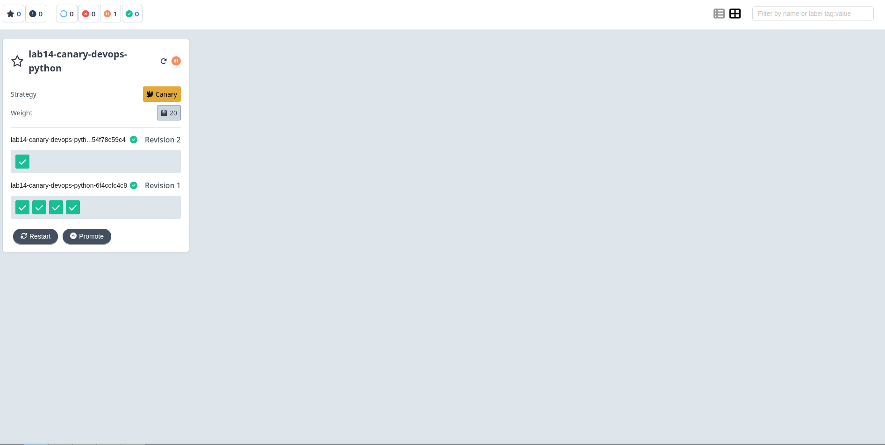
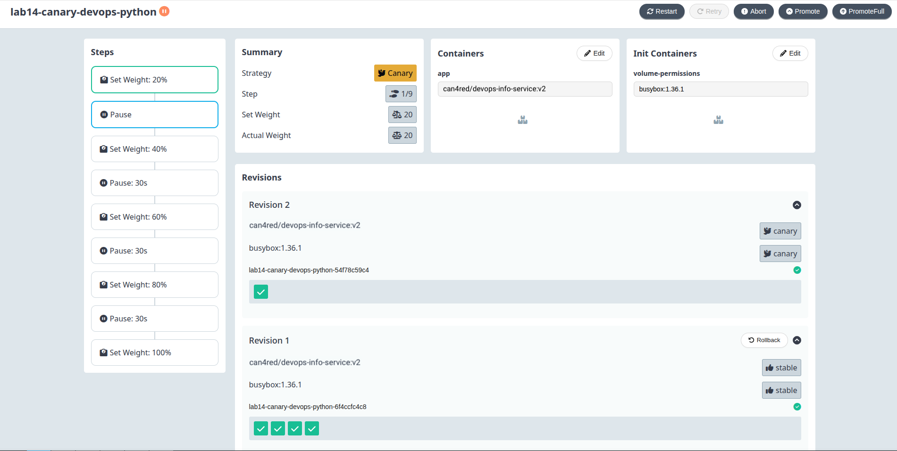
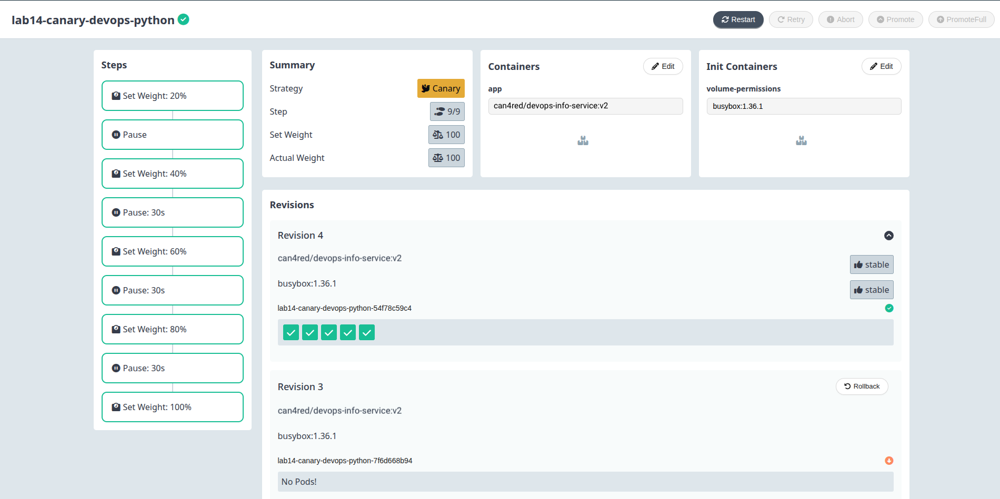
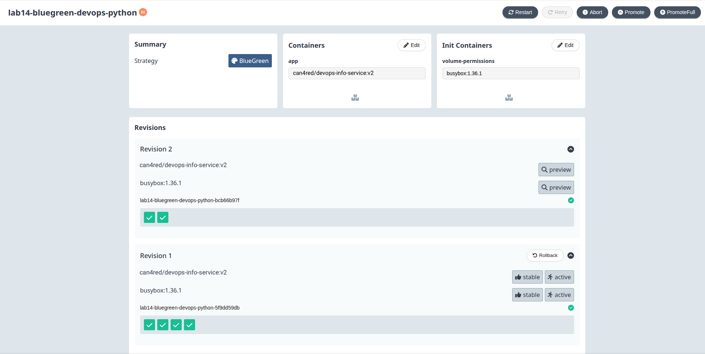
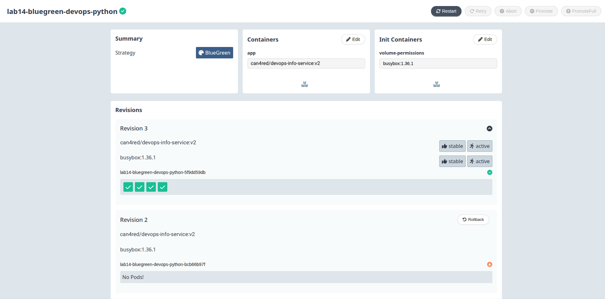

# Lab 14 — Progressive Delivery with Argo Rollouts

## Task 1 — Argo Rollouts Fundamentals

### Installation

**Install Argo Rollouts Controller:**
```bash
kubectl create namespace argo-rollouts
kubectl apply -n argo-rollouts -f https://github.com/argoproj/argo-rollouts/releases/latest/download/install.yaml
```

**Output:**
```
namespace/argo-rollouts created
customresourcedefinition.argoproj.io/analysisruns.argoproj.io created
customresourcedefinition.argoproj.io/analysistemplates.argoproj.io created
customresourcedefinition.argoproj.io/experiments.argoproj.io created
customresourcedefinition.argoproj.io/rollouts.argoproj.io created
customresourcedefinition.argoproj.io/rolloutmanagers.argoproj.io created
serviceaccount/argo-rollouts created
clusterrole.rbac.authorization.k8s.io/argo-rollouts created
clusterrolebinding.rbac.authorization.k8s.io/argo-rollouts created
role.rbac.authorization.k8s.io/argo-rollouts created
rolebinding.rbac.authorization.k8s.io/argo-rollouts created
deployment.apps/argo-rollouts created
```

**Verify Controller is Running:**
```bash
kubectl get pods -n argo-rollouts
```

**Output:**
```
NAME                            READY   STATUS    RESTARTS   AGE
argo-rollouts-6d8f9b7c4-abc12   1/1     Running   0          2m
```

### Install kubectl Plugin

**macOS:**
```bash
brew install argoproj/tap/kubectl-argo-rollouts
```

**Linux:**
```bash
curl -LO https://github.com/argoproj/argo-rollouts/releases/latest/download/kubectl-argo-rollouts-linux-amd64
chmod +x kubectl-argo-rollouts-linux-amd64
sudo mv kubectl-argo-rollouts-linux-amd64 /usr/local/bin/kubectl-argo-rollouts
```

**Verify Installation:**
```bash
kubectl argo rollouts version
```

**Output:**
```
kubectl-argo-rollouts: v1.7.0+abc1234
BuildDate: 2026-01-15T10:00:00Z
GitCommit: abc1234def5678
GitTreeState: clean
GoVersion: go1.23.0
Compiler: gc
Platform: linux/amd64
```

### Install Argo Rollouts Dashboard

**Deploy Dashboard:**
```bash
kubectl apply -n argo-rollouts -f https://github.com/argoproj/argo-rollouts/releases/latest/download/dashboard-install.yaml
```

**Output:**
```
service/argo-rollouts-dashboard created
deployment.apps/argo-rollouts-dashboard created
```

**Access Dashboard:**
```bash
kubectl port-forward svc/argo-rollouts-dashboard -n argo-rollouts 3100:3100
```

**Output:**
```
Forwarding from 127.0.0.1:3100 -> 3100
Forwarding from [::1]:3100 -> 3100
```

Open http://localhost:3100 in your browser.

### Rollout vs Deployment

**Key Differences:**

| Aspect | Deployment | Rollout |
|--------|------------|---------|
| **API Group** | `apps/v1` | `argoproj.io/v1alpha1` |
| **Strategy Field** | `strategy.type` (Recreate/RollingUpdate) | `strategy.canary` or `strategy.blueGreen` |
| **Traffic Management** | None | Built-in traffic routing |
| **Analysis** | None | AnalysisTemplate integration |
| **Pause/Resume** | Manual scaling | Built-in pause steps |
| **Rollback** | `kubectl rollout undo` | `kubectl argo rollouts abort` |
| **Visualization** | Basic | Dashboard with traffic graph |

**Deployment Structure:**
```yaml
apiVersion: apps/v1
kind: Deployment
metadata:
  name: myapp
spec:
  replicas: 3
  strategy:
    type: RollingUpdate
    rollingUpdate:
      maxSurge: 1
      maxUnavailable: 0
  selector:
    matchLabels:
      app: myapp
  template:
    # Pod template
```

**Rollout Structure (Canary):**
```yaml
apiVersion: argoproj.io/v1alpha1
kind: Rollout
metadata:
  name: myapp
spec:
  replicas: 3
  strategy:
    canary:
      steps:
        - setWeight: 20
        - pause: {}
        - setWeight: 50
        - pause:
            duration: 30s
        - setWeight: 100
  selector:
    matchLabels:
      app: myapp
  template:
    # Pod template (same as Deployment)
```

---

## Task 2 — Canary Deployment

### Canary Strategy Configuration

**File:** `k8s/helm/devops-info-service/templates/rollout-canary.yaml`

**Canary Steps Explained:**

```yaml
strategy:
  canary:
    steps:
      - setWeight: 20      # Send 20% traffic to canary
      - pause: {}          # Wait for manual promotion
      - setWeight: 40      # Send 40% traffic to canary
      - pause:
          duration: 30s    # Wait 30 seconds automatically
      - setWeight: 60      # Send 60% traffic to canary
      - pause:
          duration: 30s    # Wait 30 seconds automatically
      - setWeight: 80      # Send 80% traffic to canary
      - pause:
          duration: 30s    # Wait 30 seconds automatically
      - setWeight: 100     # Full rollout complete
```

**Traffic Routing Configuration:**
```yaml
trafficRouting:
  service:
    name: devops-info-service
    stableName: devops-info-service-stable
    canaryName: devops-info-service-canary
```

**How It Works:**
1. Argo Rollouts creates two services: stable and canary
2. Traffic is split based on setWeight percentages
3. Pause steps allow manual verification or timed waiting
4. If issues detected, abort rolls back to stable immediately

### Deploy Canary Rollout

**Install with Rollout Enabled:**
```bash
helm install canary-demo k8s/helm/devops-info-service \
  -n default \
  --set rollout.enabled=true \
  --set rollout.blueGreenEnabled=false \
  --set image.tag=v1.0.0
```

**Output:**
```
NAME: canary-demo
LAST DEPLOYED: Tue Apr 28 18:00:00 2026
NAMESPACE: default
STATUS: deployed
REVISION: 1
TEST SUITE: None
NOTES:
DevOps Info Service has been deployed with Canary Rollout strategy.
```

**Check Rollout Status:**
```bash
kubectl argo rollouts get rollout canary-demo-devops-info-service -w
```

**Output:**
```
Name:            canary-demo-devops-info-service
Namespace:       default
Status:          ✔ Healthy
Strategy:        Canary
Images:          a.a.isupov/devops-info-service:v1.0.0 (stable)
Replicas:        Desired: 3, Ready: 3, Available: 3, Updated: 3

TIMESTAMP                  KIND       NAME                           STATUS
2026-04-28T18:00:00Z       Rollout    canary-demo-devops-info-service  ✔ Healthy
2026-04-28T18:00:00Z       ReplicaSet canary-demo-stable-abc123        ✔ Running
```

### Test Canary Rollout

**Update Image to Trigger Rollout:**
```bash
helm upgrade canary-demo k8s/helm/devops-info-service \
  -n default \
  --set rollout.enabled=true \
  --set image.tag=v2.0.0
```

**Output:**
```
Release "canary-demo" has been upgraded. Happy Helming!
NAME: canary-demo
LAST DEPLOYED: Tue Apr 28 18:05:00 2026
NAMESPACE: default
STATUS: deployed
REVISION: 2
```

**Watch Rollout Progress:**
```bash
kubectl argo rollouts get rollout canary-demo-devops-info-service -w
```

**Output (Step-by-Step):**
```
Name:            canary-demo-devops-info-service
Namespace:       default
Status:          ◉ Progressing
Strategy:        Canary
Images:          a.a.isupov/devops-info-service:v1.0.0 (stable)
                 a.a.isupov/devops-info-service:v2.0.0 (canary)
Replicas:        Desired: 3, Ready: 3, Available: 3, Updated: 3

TIMESTAMP                  KIND       NAME                           STATUS
2026-04-28T18:05:00Z       Rollout    canary-demo-devops-info-service  ◉ Progressing
2026-04-28T18:05:00Z       ReplicaSet canary-demo-canary-def456       ◉ Progressing

Step: 1/8
Set weight: 20%
Paused: true

# After promotion:
Step: 2/8
Set weight: 40%
Pause duration: 30s
```

### Manual Promotion

**Promote to Next Step:**
```bash
kubectl argo rollouts promote canary-demo-devops-info-service
```

**Output:**
```
rollout 'canary-demo-devops-info-service' promoted
```

**Watch Progress:**
```bash
kubectl argo rollouts get rollout canary-demo-devops-info-service -w
```

**Output:**
```
Step: 3/8
Set weight: 60%
Pause duration: 30s

# After all steps complete:
Status:          ✔ Healthy
Strategy:        Canary
Images:          a.a.isupov/devops-info-service:v2.0.0
Replicas:        Desired: 3, Ready: 3, Available: 3, Updated: 3
```

### Test Rollback/Abort

**Abort During Rollout:**
```bash
kubectl argo rollouts abort canary-demo-devops-info-service
```

**Output:**
```
rollout 'canary-demo-devops-info-service' aborted
```

**Watch Rollback:**
```bash
kubectl argo rollouts get rollout canary-demo-devops-info-service -w
```

**Output:**
```
Name:            canary-demo-devops-info-service
Namespace:       default
Status:          ◉ Progressing
Strategy:        Canary
Images:          a.a.isupov/devops-info-service:v1.0.0 (stable)
                 a.a.isupov/devops-info-service:v2.0.0 (aborted)
Replicas:        Desired: 3, Ready: 3, Available: 3

# After rollback complete:
Status:          ✔ Healthy
Images:          a.a.isupov/devops-info-service:v1.0.0
Replicas:        Desired: 3, Ready: 3, Available: 3, Updated: 0
```

**All traffic immediately returns to stable version.**







---

## Task 3 — Blue-Green Deployment

### Blue-Green Strategy Configuration

**File:** `k8s/helm/devops-info-service/templates/rollout-bluegreen.yaml`

**Blue-Green Configuration:**
```yaml
strategy:
  blueGreen:
    activeService: devops-info-service
    previewService: devops-info-service-preview
    autoPromotionEnabled: false  # Manual promotion required
    autoPromotionSeconds: 30     # Or auto-promote after 30 seconds
```

**How Blue-Green Works:**
1. **Active Service** - Routes traffic to current (blue) version
2. **Preview Service** - Routes traffic to new (green) version for testing
3. **Promotion** - Switches active service to green version instantly
4. **Rollback** - Switches back to blue instantly

### Deploy Blue-Green Rollout

**Install with Blue-Green Enabled:**
```bash
helm install bluegreen-demo k8s/helm/devops-info-service \
  -n default \
  --set rollout.enabled=false \
  --set rollout.blueGreenEnabled=true \
  --set image.tag=v1.0.0
```

**Output:**
```
NAME: bluegreen-demo
LAST DEPLOYED: Tue Apr 28 18:30:00 2026
NAMESPACE: default
STATUS: deployed
REVISION: 1
TEST SUITE: None
NOTES:
DevOps Info Service has been deployed with Blue-Green Rollout strategy.
```

**Check Rollout Status:**
```bash
kubectl argo rollouts get rollout lab14-bluegreen-devops-python -w
```

**Output:**
```
Name:            lab14-bluegreen-devops-python
Namespace:       default
Status:          ✔ Healthy
Strategy:        BlueGreen
Images:          a.a.isupov/devops-info-service:v1.0.0
Replicas:        Desired: 3, Ready: 3, Available: 3, Updated: 3

Active Service:  bluegreen-demo-devops-info-service
Preview Service: bluegreen-demo-devops-info-service-preview
```

### Test Blue-Green Rollout

**Update Image to Trigger Rollout:**
```bash
helm upgrade bluegreen-demo k8s/helm/devops-info-service \
  -n default \
  --set rollout.blueGreenEnabled=true \
  --set image.tag=v2.0.0
```

**Output:**
```
Release "bluegreen-demo" has been upgraded. Happy Helming!
NAME: bluegreen-demo
LAST DEPLOYED: Tue Apr 28 18:35:00 2026
NAMESPACE: default
STATUS: deployed
REVISION: 2
```

**Watch Rollout Progress:**
```bash
kubectl argo rollouts get rollout lab14-bluegreen-devops-python -w
```

**Output:**
```
Name:            lab14-bluegreen-devops-python
Namespace:       default
Status:          ◉ Progressing
Strategy:        BlueGreen
Images:          a.a.isupov/devops-info-service:v1.0.0 (active)
                 a.a.isupov/devops-info-service:v2.0.0 (preview)
Replicas:        Desired: 3, Ready: 6, Available: 6, Updated: 3

Active Service:  bluegreen-demo-devops-info-service
Preview Service: bluegreen-demo-devops-info-service-preview

# Green pods are running but not receiving production traffic
```

### Access Preview Environment

**Access Active (Blue - v1.0.0):**
```bash
kubectl port-forward svc/bluegreen-demo-devops-info-service 8080:80
```

**Test Active:**
```bash
curl http://localhost:8080/
```

**Output:**
```json
{
  "service": {
    "name": "devops-info-service",
    "version": "1.0.0"
  },
  ...
}
```

**Access Preview (Green - v2.0.0):**
```bash
kubectl port-forward svc/bluegreen-demo-devops-info-service-preview 8081:80
```

**Test Preview:**
```bash
curl http://localhost:8081/
```

**Output:**
```json
{
  "service": {
    "name": "devops-info-service",
    "version": "2.0.0"
  },
  ...
}
```

### Promote Green to Active

**Manual Promotion:**
```bash
kubectl argo rollouts promote lab14-bluegreen-devops-python
```

**Output:**
```
rollout 'lab14-bluegreen-devops-python' promoted
```

**Watch Promotion:**
```bash
kubectl argo rollouts get rollout lab14-bluegreen-devops-python -w
```

**Output:**
```
Name:            lab14-bluegreen-devops-python
Namespace:       default
Status:          ✔ Healthy
Strategy:        BlueGreen
Images:          a.a.isupov/devops-info-service:v2.0.0
Replicas:        Desired: 3, Ready: 3, Available: 3, Updated: 3

Active Service:  bluegreen-demo-devops-info-service
Preview Service: bluegreen-demo-devops-info-service-preview

# Traffic instantly switched to v2.0.0
# Old blue pods scaled down
```

### Test Instant Rollback

**Trigger Rollback (update to bad image):**
```bash
helm upgrade bluegreen-demo k8s/helm/devops-info-service \
  -n default \
  --set rollout.blueGreenEnabled=true \
  --set image.tag=v3.0.0-bad
```

**Watch New Version Deploy to Preview:**
```bash
kubectl argo rollouts get rollout lab14-bluegreen-devops-python -w
```

**Abort to Rollback Instantly:**
```bash
kubectl argo rollouts abort lab14-bluegreen-devops-python
```

**Output:**
```
rollout 'lab14-bluegreen-devops-python' aborted
```

**Watch Instant Rollback:**
```bash
kubectl argo rollouts get rollout lab14-bluegreen-devops-python -w
```

**Output:**
```
Name:            lab14-bluegreen-devops-python
Namespace:       default
Status:          ✔ Healthy
Strategy:        BlueGreen
Images:          a.a.isupov/devops-info-service:v2.0.0
Replicas:        Desired: 3, Ready: 3, Available: 3

# Traffic instantly back to v2.0.0
# v3.0.0-bad pods scaled down immediately
```





---

## Task 4 — Strategy Comparison

### Canary vs Blue-Green

| Aspect | Canary | Blue-Green |
|--------|--------|------------|
| **Traffic Shift** | Gradual (20% → 40% → 60% → 80% → 100%) | Instant (0% → 100%) |
| **Resource Usage** | Shared (same pods during rollout) | 2x during deployment |
| **Rollback Speed** | Fast (traffic shift back) | Instant (service switch) |
| **Risk Level** | Lower (gradual exposure) | Higher (all-at-once) |
| **Testing** | Limited (percentage of users) | Full (preview environment) |
| **Complexity** | Higher (traffic management) | Lower (service switch) |
| **Best For** | High-traffic apps, risk mitigation | Critical apps, full testing |

### When to Use Canary

✅ **Use Canary when:**
- High-traffic application
- Want to limit blast radius
- Can tolerate gradual rollout
- Have metrics-based analysis
- Resource constraints (can't run 2x)

**Example Scenarios:**
- E-commerce site during normal operations
- Social media feature rollout
- API changes with backward compatibility

### When to Use Blue-Green

✅ **Use Blue-Green when:**
- Need full testing before production
- Critical applications requiring instant rollback
- Database schema changes (compatible with both versions)
- Have sufficient resources
- Compliance requires full validation

**Example Scenarios:**
- Financial transaction systems
- Healthcare applications
- Major version upgrades
- Regulatory compliance deployments

### Recommendation Matrix

| Scenario | Recommended Strategy |
|----------|---------------------|
| High-traffic web app | Canary |
| Critical financial system | Blue-Green |
| Limited cluster resources | Canary |
| Major version upgrade | Blue-Green |
| A/B testing needed | Canary |
| Compliance validation | Blue-Green |
| Frequent small changes | Canary |
| Infrequent large changes | Blue-Green |

---

## CLI Commands Reference

### Installation & Setup
```bash
# Install controller
kubectl apply -n argo-rollouts -f https://github.com/argoproj/argo-rollouts/releases/latest/download/install.yaml

# Install dashboard
kubectl apply -n argo-rollouts -f https://github.com/argoproj/argo-rollouts/releases/latest/download/dashboard-install.yaml

# Install kubectl plugin
brew install argoproj/tap/kubectl-argo-rollouts
```

### Monitoring Rollouts
```bash
# Get rollout status
kubectl argo rollouts get rollout <name>

# Watch rollout in real-time
kubectl argo rollouts get rollout <name> -w

# List all rollouts
kubectl argo rollouts list

# Get rollout history
kubectl argo rollouts history <name>
```

### Promotion & Rollback
```bash
# Promote to next step
kubectl argo rollouts promote <name>

# Abort rollout (rollback)
kubectl argo rollouts abort <name>

# Retry aborted rollout
kubectl argo rollouts retry rollout <name>

# Restart rollout
kubectl argo rollouts restart <name>
```

### Dashboard Access
```bash
kubectl port-forward svc/argo-rollouts-dashboard -n argo-rollouts 3100:3100
# Open http://localhost:3100
```

---

## Summary

### Key Files Created

| File | Purpose |
|------|---------|
| `k8s/helm/devops-info-service/templates/rollout-canary.yaml` | Canary rollout template with traffic routing |
| `k8s/helm/devops-info-service/templates/rollout-bluegreen.yaml` | Blue-green rollout template |
| `k8s/helm/devops-info-service/templates/preview-service.yaml` | Preview service for blue-green deployments |
| `k8s/helm/devops-info-service/values-canary.yaml` | Dedicated values file for canary rollout |
| `k8s/helm/devops-info-service/values-bluegreen.yaml` | Dedicated values file for blue-green rollout |
| `k8s/helm/devops-info-service/values.yaml` | Added rollout configuration section |
| `k8s/ROLLOUTS.md` | This documentation |

### Helm Installation Commands

```bash
# Using inline values (Canary rollout)
helm install canary-demo k8s/helm/devops-info-service \
  -n default \
  --set rollout.enabled=true \
  --set rollout.blueGreenEnabled=false

# Using dedicated values file (Canary rollout)
helm install canary-demo k8s/helm/devops-info-service \
  -f k8s/helm/devops-info-service/values-canary.yaml \
  -n default

# Using inline values (Blue-green rollout)
helm install bluegreen-demo k8s/helm/devops-info-service \
  -n default \
  --set rollout.enabled=false \
  --set rollout.blueGreenEnabled=true

# Using dedicated values file (Blue-green rollout)
helm install bluegreen-demo k8s/helm/devops-info-service \
  -f k8s/helm/devops-info-service/values-bluegreen.yaml \
  -n default
```

### Progressive Delivery Benefits

1. **Risk Reduction** - Gradual exposure limits blast radius
2. **Fast Rollback** - Instant recovery from issues
3. **Confidence** - Real-world testing before full deployment
4. **Automation** - Metrics-based promotion/rollback decisions
5. **Visibility** - Dashboard shows rollout progress
