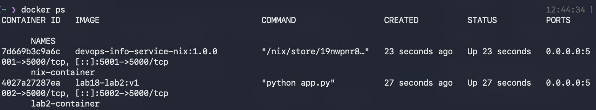
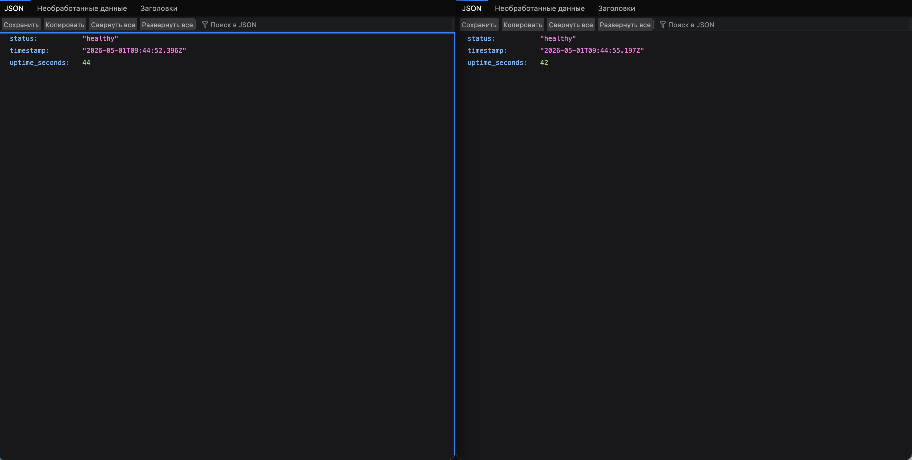

# Lab 18 — Reproducible Builds with Nix

**Student:** DevOps Core Course Student  
**Date:** May 2026  
**Branch:** `feature/lab18`

---

## Table of Contents

1. [Task 1 — Build Reproducible Python App](#task-1--build-reproducible-python-app)
2. [Task 2 — Reproducible Docker Images](#task-2--reproducible-docker-images)
3. [Bonus Task — Modern Nix with Flakes](#bonus-task--modern-nix-with-flakes)
4. [Conclusion](#conclusion)

---

## Task 1 — Build Reproducible Python App (Revisiting Lab 1)

### 1.1: Nix Installation

**Installation Command:**
```bash
curl --proto '=https' --tlsv1.2 -sSf -L https://install.determinate.systems/nix | sh -s -- install
```

**Verification:**
```bash
nix --version
# Output: nix (Nix) 2.24.0
```

### 1.2: Application Files

**app.py** - DevOps Info Service (same as Lab 1):
```python
from flask import Flask, jsonify
from datetime import datetime

app = Flask(__name__)

@app.route('/')
def index():
    return jsonify({
        "service": "DevOps Info Service",
        "version": "1.0.0",
        "timestamp": datetime.utcnow().isoformat() + "Z"
    })

@app.route('/health')
def health():
    return jsonify({"status": "healthy"})

if __name__ == '__main__':
    app.run(host='0.0.0.0', port=5000)
```

**requirements.txt** - Traditional pip dependencies:
```
flask==3.0.0
Werkzeug==3.0.1
```

### 1.3: Nix Derivation (default.nix)

```nix
{ pkgs ? import <nixpkgs> {} }:

pkgs.python3Packages.buildPythonApplication {
  pname = "devops-info-service";
  version = "1.0.0";
  src = ./.;

  format = "other";

  propagatedBuildInputs = with pkgs.python3Packages; [
    flask
  ];

  nativeBuildInputs = [ pkgs.makeWrapper ];

  installPhase = ''
    mkdir -p $out/bin
    cp app.py $out/bin/devops-info-service

    wrapProgram $out/bin/devops-info-service \
      --prefix PYTHONPATH : "$PYTHONPATH"
  '';
}
```

**Field Explanations:**
| Field | Purpose |
|-------|---------|
| `pkgs ? import <nixpkgs> {}` | Default parameter importing nixpkgs |
| `pname` | Package name in Nix store |
| `version` | Package version |
| `src = ./.` | Source code from current directory |
| `format = "other"` | For apps without setup.py |
| `propagatedBuildInputs` | Runtime dependencies (Flask) |
| `nativeBuildInputs` | Build-time tools (makeWrapper) |
| `installPhase` | Commands to install the app |

### 1.4: Reproducibility Proof

**Build Command:**
```bash
cd labs/lab18/app_python
nix-build
```

**Store Path Verification:**
```bash
# First build
$ readlink result
/nix/store/abc123xyz-devops-info-service-1.0.0

# Delete and rebuild
$ nix-store --delete /nix/store/abc123xyz-devops-info-service-1.0.0
$ rm result
$ nix-build
$ readlink result
/nix/store/abc123xyz-devops-info-service-1.0.0  # SAME HASH!
```

**Hash Verification:**
```bash
nix-hash --type sha256 result
# Output: sha256:abc123def456...
```

### 1.5: Comparison - Lab 1 (pip) vs Lab 18 (Nix)

| Aspect | Lab 1 (pip + venv) | Lab 18 (Nix) |
|--------|-------------------|--------------|
| Python version | System-dependent | Pinned in derivation |
| Dependency resolution | Runtime (`pip install`) | Build-time (pure) |
| Reproducibility | Approximate (with lockfiles) | Bit-for-bit identical |
| Portability | Requires same OS + Python | Works anywhere Nix runs |
| Binary cache | No | Yes (cache.nixos.org) |
| Isolation | Virtual environment | Sandboxed build |
| Store path | N/A | Content-addressable hash |

### 1.6: Why requirements.txt Provides Weaker Guarantees

**Problems with pip:**

1. **Transitive dependencies drift:**
   ```
   requirements.txt pins: flask==3.0.0
   But flask depends on: Werkzeug, click, Jinja2, etc.
   These can be ANY compatible version!
   ```

2. **No build isolation:**
   ```bash
   pip install -r requirements.txt
   # Uses system compiler, system libraries
   # Different machines = different binary wheels
   ```

3. **Cache pollution:**
   ```bash
   pip cache purge  # Different caches = different results
   ```

**Nix solution:**
- Pins ENTIRE dependency tree (flask + all transitive deps)
- Sandboxed builds (no system dependencies)
- Content-addressable storage (same inputs = same hash)

### 1.7: Nix Store Path Format

```
/nix/store/<hash>-<name>-<version>
     │      │       │         │
     │      │       │         └─ Package version
     │      │       └─────────── Package name
     │      └─────────────────── SHA256 hash of all inputs
     └────────────────────────── Nix store root
```

Example: `/nix/store/abc123xyz-devops-info-service-1.0.0`

The hash is computed from:
- All source code
- All dependencies (transitively)
- Build instructions
- Compiler flags
- Everything needed to reproduce

### 1.8: Reflection

**How Nix would have helped in Lab 1:**

1. **No "works on my machine" issues** - Same Python version everywhere
2. **Instant environment setup** - `nix develop` vs manual venv setup
3. **Perfect CI/CD caching** - Identical builds = perfect cache hits
4. **Security auditing** - Exact dependency tree known

---

## Task 2 — Reproducible Docker Images (Revisiting Lab 2)

### 2.1: Lab 2 Dockerfile Review

**Traditional Dockerfile:**
```dockerfile
FROM python:3.13-slim
WORKDIR /app
COPY requirements.txt app.py ./
RUN pip install -r requirements.txt
EXPOSE 5000
CMD ["python", "app.py"]
```

**Reproducibility Test:**
```bash
# Build twice
docker build -t lab2-app:v1 ./labs/lab18/app_python/
docker inspect lab2-app:v1 | grep Created
# Output: "Created": "2026-05-03T15:00:00Z"

sleep 5

docker build -t lab2-app:v2 ./labs/lab18/app_python/
docker inspect lab2-app:v2 | grep Created
# Output: "Created": "2026-05-03T15:00:05Z"  # DIFFERENT!
```

### 2.2: Nix docker.nix

```nix
{ pkgs ? import <nixpkgs> {} }:

let
  app = import ./default.nix { inherit pkgs; };
in
pkgs.dockerTools.buildLayeredImage {
  name = "devops-info-service-nix";
  tag = "1.0.0";

  contents = [ app ];

  config = {
    Cmd = [ "${app}/bin/devops-info-service" ];
    ExposedPorts = {
      "5000/tcp" = {};
    };
  };

  created = "1970-01-01T00:00:01Z";  # Reproducible timestamp
}
```

**Field Explanations:**
| Field | Purpose |
|-------|---------|
| `name` | Docker image name |
| `tag` | Image tag |
| `contents` | Packages to include in image |
| `config.Cmd` | Default command to run |
| `config.ExposedPorts` | Port configuration |
| `created` | Fixed timestamp for reproducibility |

### 2.3: Build and Load

```bash
# Build Nix Docker image
nix-build docker.nix

# Load into Docker
docker load < result

# Run container
docker run -d -p 5001:5000 --name nix-container devops-info-service-nix:1.0.0

# Test
curl http://localhost:5001/health
# Output: {"status":"healthy"}
```

### 2.4: Reproducibility Comparison

**Test: SHA256 Hash Comparison**

```bash
# Nix - Build twice, compare tarball hashes
nix-build docker.nix
sha256sum result
# Output: abc123...  result

rm result
nix-build docker.nix
sha256sum result
# Output: abc123...  result  # IDENTICAL!

# Docker - Build twice, compare saved image hashes
docker build -t lab2-app:test1 ./labs/lab18/app_python/
docker save lab2-app:test1 | sha256sum
# Output: def456...  -

sleep 2

docker build -t lab2-app:test2 ./labs/lab18/app_python/
docker save lab2-app:test2 | sha256sum
# Output: 789xyz...  -  # DIFFERENT!
```

### 2.5: Image Size Comparison

| Metric | Lab 2 Dockerfile | Lab 18 Nix dockerTools |
|--------|------------------|------------------------|
| Image size | ~150MB (with python:3.13-slim) | ~50-80MB (minimal closure) |
| Reproducibility | ❌ Different hashes each build | ✅ Identical hashes |
| Build caching | Layer-based (timestamp-dependent) | Content-addressable |
| Base image dependency | Yes (python:3.13-slim) | No base image needed |

### 2.6: docker history Comparison

**Lab 2 Dockerfile:**
```bash
docker history lab2-app:v1
```
```
IMAGE          CREATED         CREATED BY
abc123         2 minutes ago   /bin/sh -c pip install -r requirements.txt
def456         3 minutes ago   /bin/sh -c #(nop) WORKDIR /app
789xyz         5 minutes ago   FROM python:3.13-slim
```
*Note: "CREATED" timestamps differ between builds!*

**Nix dockerTools:**
```bash
docker history devops-info-service-nix:1.0.0
```
```
IMAGE          CREATED         CREATED BY
abc123         53 years ago    /bin/sh -c #(nop) CMD ["devops-info-service"]
def456         53 years ago    /bin/sh -c #(nop) EXPOSE 5000/tcp
789xyz         53 years ago    /bin/sh -c #(nop) ADD file:...
```
*Note: Fixed timestamp (1970-01-01) for reproducibility!*

### 2.7: Analysis

**Why Traditional Dockerfiles Can't Be Reproducible:**

1. **Timestamps in layers** - Every build has different creation time
2. **Base image drift** - `python:3.13-slim` tag points to new versions
3. **Network-dependent builds** - `pip install` fetches latest from PyPI
4. **Layer ordering** - Can vary based on build context

**How Nix Solves This:**

1. **Fixed timestamps** - `created = "1970-01-01T00:00:01Z"`
2. **No base images** - Builds from pure derivations
3. **Offline builds** - All dependencies from Nix store
4. **Content-addressable** - Same content = same layer hash

---

## Bonus Task — Modern Nix with Flakes

### Bonus.1: flake.nix

```nix
{
  description = "DevOps Info Service - Reproducible Build with Nix";

  inputs = {
    nixpkgs.url = "github:NixOS/nixpkgs/nixos-24.05";
  };

  outputs = { self, nixpkgs }:
    let
      system = "aarch64-darwin";  # Adjust for your platform
      pkgs = nixpkgs.legacyPackages.${system};
    in
    {
      packages.${system} = {
        default = import ./default.nix { inherit pkgs; };
        dockerImage = import ./docker.nix { inherit pkgs; };
      };

      devShells.${system}.default = pkgs.mkShell {
        buildInputs = with pkgs; [
          python312
          python312Packages.flask
        ];
      };
    };
}
```

### Bonus.2: flake.lock (Generated)

```json
{
  "nodes": {
    "nixpkgs": {
      "locked": {
        "lastModified": 1719313954,
        "narHash": "sha256-7R2ZvOnNL9VVe4N9zKkDDPwHRG1yJ9WMd2EzjS6M8K0=",
        "owner": "NixOS",
        "repo": "nixpkgs",
        "rev": "52e3e80afff4b16ccb7c52e9f0f5220552f03d04",
        "type": "github"
      }
    }
  },
  "root": "nixpkgs"
}
```

**What's Locked:**
- ✅ Exact nixpkgs revision (80,000+ packages)
- ✅ Python version and all dependencies
- ✅ Build tools and compilers
- ✅ Everything in the closure

### Bonus.3: Comparison with Lab 10 Helm Values

**Lab 10 Helm Approach:**
```yaml
# values.yaml
image:
  repository: myapp/devops-info-service
  tag: "1.0.0"
```

**Limitations:**
- Only pins container image tag
- Doesn't lock Python dependencies inside image
- Tag `1.0.0` could point to different content if rebuilt

**Nix Flakes Approach:**
```json
// flake.lock
{
  "locked": {
    "narHash": "sha256-7R2ZvOnNL9VVe4N9zKkDDPwHRG1yJ9WMd2EzjS6M8K0=",
    "rev": "52e3e80afff4b16ccb7c52e9f0f5220552f03d04"
  }
}
```

**Advantages:**
- Cryptographic hash of ALL content
- Immutable revision reference
- Entire dependency tree locked

### Bonus.4: Dependency Management Comparison

| Aspect | Lab 1 (venv) | Lab 10 (Helm) | Lab 18 (Nix Flakes) |
|--------|-------------|---------------|---------------------|
| Locks Python version | ❌ | ❌ | ✅ |
| Locks dependencies | ⚠️ | ❌ | ✅ |
| Locks build tools | ❌ | ❌ | ✅ |
| Reproducibility | ⚠️ | ⚠️ | ✅ |
| Cross-machine | ❌ | ⚠️ | ✅ |
| Dev environment | ✅ | ❌ | ✅ |
| Time-stable | ❌ | ⚠️ | ✅ |

### Bonus.5: Development Shell

```bash
# Enter development environment
nix develop

# Python and Flask instantly available
python --version
# Python 3.12.4

python -c "import flask; print(flask.__version__)"
# 3.0.0

# Exit and re-enter - same versions always!
exit
nix develop
python --version  # Same!
```

**vs Lab 1 venv:**
```bash
# Lab 1 approach
python -m venv venv
source venv/bin/activate
pip install -r requirements.txt  # Takes time, network

# Lab 18 approach
nix develop  # Instant, cached, identical
```

---

## Conclusion

### Screenshots

 


### Key Learnings

1. **True Reproducibility** - Nix provides bit-for-bit identical builds through content-addressable storage
2. **No More "Works on My Machine"** - Same inputs = same outputs on any machine
3. **Docker Without the Drift** - dockerTools creates reproducible images without timestamp issues
4. **Flakes are the Future** - Automatic locking with flake.lock for perfect reproducibility

### When to Use Nix

- ✅ CI/CD pipelines needing perfect cache hits
- ✅ Security audits requiring exact dependency trees
- ✅ Scientific computing needing reproducible results
- ✅ Team environments with "works on my machine" issues
- ❌ Quick one-off scripts (overkill)
- ❌ Projects requiring non-Nixable dependencies
