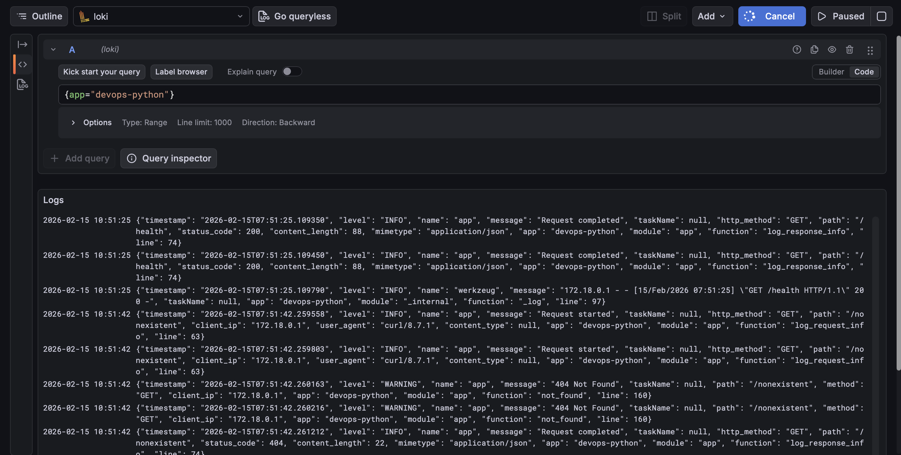
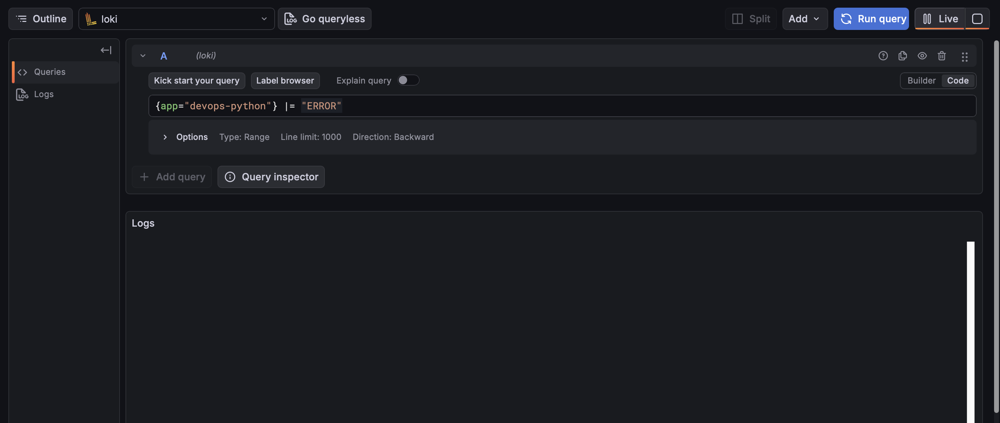
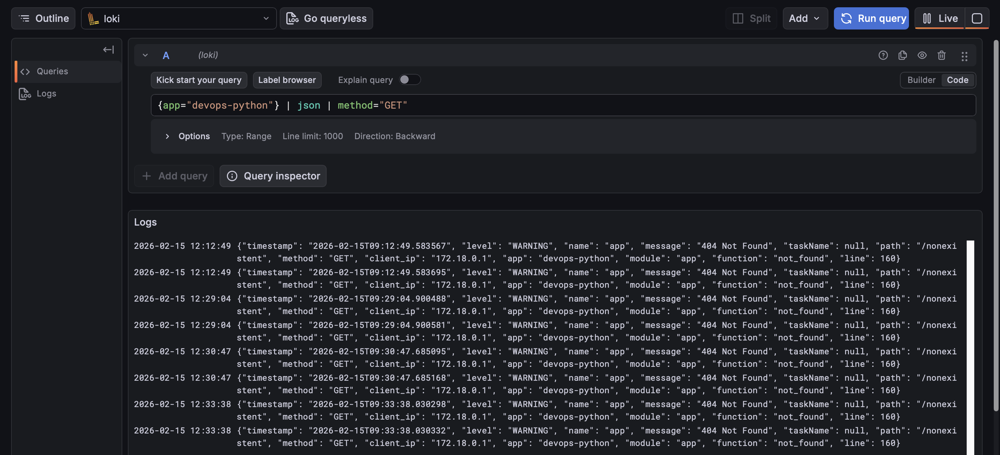
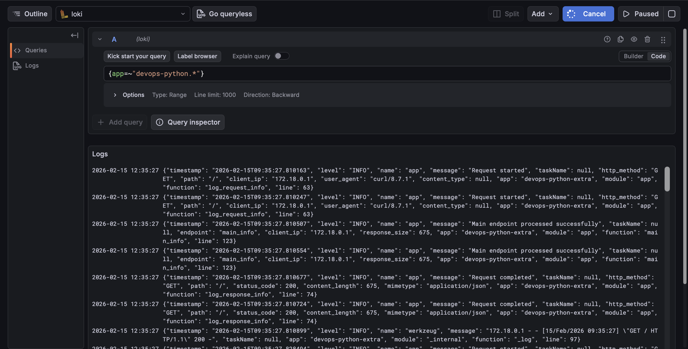
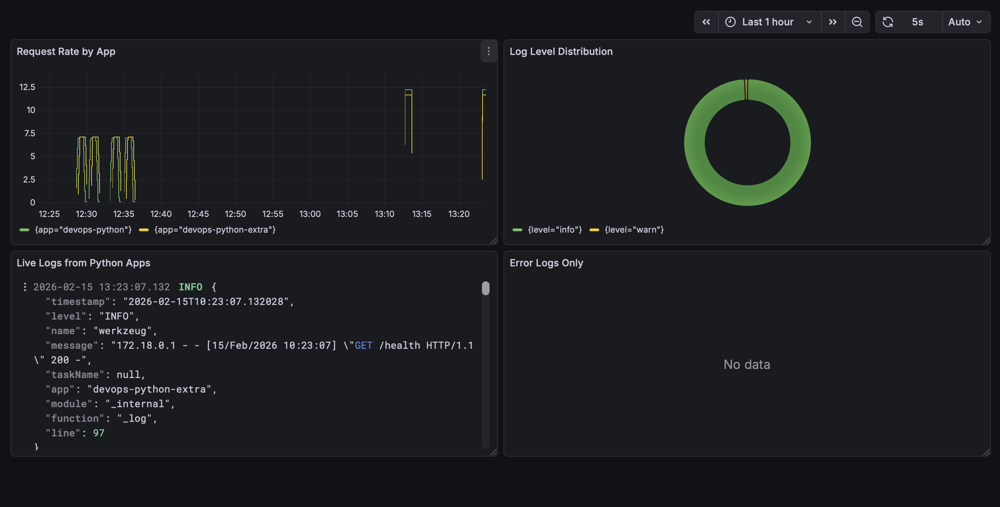
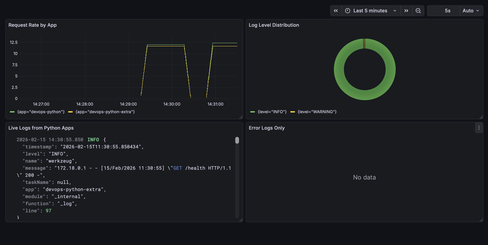

# Lab 7 — Observability & Logging with Loki Stack

## Architecture

The monitoring stack consists of three main components:

1. **Loki** - Log storage engine with TSDB backend
2. **Promtail** - Log collector that reads Docker container logs
3. **Grafana** - Visualization platform for log data

```
┌─────────────────┐    ┌──────────────────┐    ┌─────────────────┐
│   Application   │    │    Promtail      │    │     Loki        │
│   Containers    │────│  (Log Collector) │────│ (Log Storage)   │
└─────────────────┘    └──────────────────┘    └─────────────────┘
                                                              │
                                                              ▼
                                                    ┌─────────────────┐
                                                    │    Grafana      │
                                                    │ (Visualization) │
                                                    └─────────────────┘
```

## Setup Guide

### Prerequisites
- Docker and Docker Compose installed
- Python application from Lab 1

### Deployment Steps

1. Navigate to the monitoring directory
2. Start the monitoring stack
3. Verify services are running
4. Check Loki readiness
5. Check Promtail targets
6. Access Grafana

## Configuration

### Loki Configuration (`loki/config.yml`)

Key features of our Loki configuration:
- Uses TSDB index type for improved performance (10x faster queries)
- Filesystem storage for simplicity in single-instance setup
- 7-day log retention policy
- Schema v13 for compatibility with Loki 3.0

### Promtail Configuration (`promtail/config.yml`)

Key features of our Promtail configuration:
- Docker service discovery to automatically find containers
- Label filtering to only collect logs from containers with `logging=promtail`
- Relabeling to extract container names and app labels
- JSON log parsing support

### Application Logging

The Python application has been enhanced with structured JSON logging using the `python-json-logger` library. Key features:
- All log entries are formatted as JSON
- Includes contextual information like method, path, client IP, and status codes
- Different log levels for various events (INFO, DEBUG, WARNING, ERROR)
- Consistent timestamp format with timezone information

## Dashboard

The Grafana dashboard includes four panels:

1. **Logs Table** - Shows recent logs from all applications
   - Query: `{app=~"devops-.*"}`
   - Displays structured log data in a table format

2. **Request Rate** - Time series graph showing logs per second by application
   - Query: `sum by (app) (rate({app=~"devops-.*"} [1m]))`
   - Visualizes request volume trends over time

3. **Error Logs** - Dedicated view for ERROR level logs
   - Query: `{app=~"devops-.*"} | json | level="ERROR"`
   - Helps quickly identify application issues

4. **Log Level Distribution** - Pie chart showing distribution of log levels
   - Query: `sum by (level) (count_over_time({app=~"devops-.*"} | json [5m]))`
   - Provides insight into the ratio of different log types

## Production Configuration

### Resource Limits
All services have resource constraints to prevent resource exhaustion:
- Loki: 512MB memory limit, 1GB reservation
- Promtail: 256MB memory limit, 128MB reservation
- Grafana: 1GB memory limit, 512MB reservation
- Application: 256MB memory limit, 128MB reservation

### Security
- Grafana anonymous access disabled in production configuration
- Non-root user for application container
- Minimal permissions for Promtail Docker socket access

## Challenges and Solutions

### Challenge 1: JSON Log Parsing
**Problem**: Getting Promtail to correctly parse JSON logs from the application.
**Solution**: Used the `| json` parser in LogQL queries and ensured consistent JSON formatting in the application.

### Challenge 2: Container Discovery
**Problem**: Ensuring Promtail only collects logs from relevant containers.
**Solution**: Implemented label-based filtering with `logging=promtail` and `app=devops-python` labels.

### Challenge 3: Resource Constraints
**Problem**: Balancing performance with resource usage.
**Solution**: Implemented appropriate resource limits and reservations for each service based on their typical usage patterns.

## Deploy Loki Stack

### Logs from Python app


### Errors logs


### Parse JSON and filter


### Both applications


## Build Log Dashboard


## Build Log Dashboard

```bash
docker compose ps
```

```bash
NAME               IMAGE                        COMMAND                  SERVICE            CREATED              STATUS                                 PORTS
app-python         info-service-python:latest   "python app.py"          app-python         About a minute ago   Up About a minute (healthy)            0.0.0.0:8000->5000/tcp
app-python-extra   info-service-python:latest   "python app.py"          app-python-extra   About a minute ago   Up About a minute (healthy)            0.0.0.0:8001->5000/tcp
grafana            grafana/grafana:12.3.1       "/run.sh"                grafana            About a minute ago   Up About a minute (healthy)            0.0.0.0:3000->3000/tcp
loki               grafana/loki:3.0.0           "/usr/bin/loki -conf…"   loki               About a minute ago   Up About a minute (healthy)            0.0.0.0:3100->3100/tcp
promtail           grafana/promtail:3.0.0       "/usr/bin/promtail -…"   promtail           About a minute ago   Up About a minute (healthy)   0.0.0.0:9080->9080/tcp
```


## Ansible Automation

### Ansible playbook execution

```bash
ansible-playbook -i inventory/hosts.ini playbooks/deploy-monitoring.yml
```

```bash
PLAY [Deploy Loki Monitoring Stack] *****************************************************************************************************************************

TASK [Gathering Facts] ******************************************************************************************************************************************
ok: [info-service]

TASK [Display deployment info] **********************************************************************************************************************************
ok: [info-service] => {
    "msg": "========================================\nDeploying Monitoring Stack\nLoki: 3.0.0\nGrafana: 12.3.1\nRetention: 168h\n========================================\n"
}

TASK [docker : Include cleanup tasks] ***************************************************************************************************************************
included: /Users/can4red/Aleksandr-Isupov-DevOps-Core-Course/ansible/roles/docker/tasks/cleanup.yml for info-service

TASK [docker : Remove all Docker repository files] **************************************************************************************************************
ok: [info-service] => (item=/etc/apt/sources.list.d/docker.list)
ok: [info-service] => (item=/etc/apt/sources.list.d/additional-repositories.list)
ok: [info-service] => (item=/etc/apt/keyrings/docker.gpg)
ok: [info-service] => (item=/etc/apt/keyrings/docker.asc)
ok: [info-service] => (item=/usr/share/keyrings/docker.gpg)
ok: [info-service] => (item=/etc/apt/trusted.gpg.d/docker.gpg)
ok: [info-service] => (item=/etc/apt/trusted.gpg.d/docker-archive-keyring.gpg)
ok: [info-service] => (item=/etc/apt/trusted.gpg.d/docker-ce.gpg)

TASK [docker : Remove any Docker repository from sources.list] **************************************************************************************************
ok: [info-service]

TASK [docker : Remove any Docker repository from sources.list.d] ************************************************************************************************
ok: [info-service]

TASK [docker : Clean apt cache] *********************************************************************************************************************************
ok: [info-service]

TASK [docker : Update apt cache] ********************************************************************************************************************************
changed: [info-service]

TASK [docker : Create keyrings directory] ***********************************************************************************************************************
ok: [info-service]

TASK [docker : Install Docker prerequisites] ********************************************************************************************************************
ok: [info-service]

TASK [docker : Add Docker GPG key] ******************************************************************************************************************************
ok: [info-service]

TASK [docker : Add Docker repository] ***************************************************************************************************************************
ok: [info-service]

TASK [docker : Update apt cache after repository setup] *********************************************************************************************************
changed: [info-service]

TASK [docker : Install Docker packages] *************************************************************************************************************************
ok: [info-service]

TASK [docker : Ensure pip is up to date] ************************************************************************************************************************
ok: [info-service]

TASK [docker : Install Docker Python SDK] ***********************************************************************************************************************
ok: [info-service]

TASK [docker : Start and enable Docker service] *****************************************************************************************************************
ok: [info-service]

TASK [docker : Wait for Docker to be ready] *********************************************************************************************************************
ok: [info-service]

TASK [docker : Add users to docker group] ***********************************************************************************************************************
ok: [info-service] => (item=ubuntu)
ok: [info-service] => (item=appuser)

TASK [docker : Create docker-compose directory] *****************************************************************************************************************
ok: [info-service]

TASK [docker : Verify Docker installation] **********************************************************************************************************************
ok: [info-service]

TASK [docker : Display Docker version] **************************************************************************************************************************
ok: [info-service] => {
    "msg": "Docker version: Docker version 29.2.1, build a5c7197"
}

TASK [common : Update apt cache] ********************************************************************************************************************************
ok: [info-service]

TASK [common : Install common packages] *************************************************************************************************************************
ok: [info-service]

TASK [common : Upgrade system packages] *************************************************************************************************************************
skipping: [info-service]

TASK [common : Log package installation completion] *************************************************************************************************************
ok: [info-service] => {
    "msg": "Package installation block completed"
}

TASK [common : Create completion timestamp] *********************************************************************************************************************
changed: [info-service]

TASK [common : Create application user] *************************************************************************************************************************
ok: [info-service]

TASK [common : Ensure SSH directory exists for app user] ********************************************************************************************************
ok: [info-service]

TASK [common : Add users to sudo group] *************************************************************************************************************************
skipping: [info-service]

TASK [common : User management completed] ***********************************************************************************************************************
ok: [info-service] => {
    "msg": "User management block finished"
}

TASK [common : Set timezone] ************************************************************************************************************************************
ok: [info-service]

TASK [common : Configure hostname] ******************************************************************************************************************************
ok: [info-service]

TASK [common : Configure SSH hardening] *************************************************************************************************************************
ok: [info-service] => (item={'key': 'PasswordAuthentication', 'value': 'no'})
ok: [info-service] => (item={'key': 'PermitRootLogin', 'value': 'no'})
ok: [info-service] => (item={'key': 'ClientAliveInterval', 'value': '300'})

TASK [monitoring : Include setup tasks] *************************************************************************************************************************
included: /Users/can4red/Aleksandr-Isupov-DevOps-Core-Course/ansible/roles/monitoring/tasks/setup.yml for info-service

TASK [monitoring : Create monitoring directories] ***************************************************************************************************************
changed: [info-service] => (item=/opt/monitoring)
changed: [info-service] => (item=/opt/monitoring/loki)
changed: [info-service] => (item=/opt/monitoring/promtail)
changed: [info-service] => (item=/var/lib/monitoring)

TASK [monitoring : Remove Loki config if it is a directory] *****************************************************************************************************
changed: [info-service]

TASK [monitoring : Template Loki configuration] *****************************************************************************************************************
changed: [info-service]

TASK [monitoring : Template Promtail configuration] *************************************************************************************************************
changed: [info-service]

TASK [monitoring : Template Docker Compose file] ****************************************************************************************************************
changed: [info-service]

TASK [monitoring : Login to Docker Hub] *************************************************************************************************************************
skipping: [info-service]

TASK [monitoring : Include deploy tasks] ************************************************************************************************************************
included: /Users/can4red/Aleksandr-Isupov-DevOps-Core-Course/ansible/roles/monitoring/tasks/deploy.yml for info-service

TASK [monitoring : Deploy monitoring stack with Docker Compose] *************************************************************************************************
changed: [info-service]

TASK [monitoring : Display compose result] **********************************************************************************************************************
ok: [info-service] => {
    "msg": "Stack deployed: []"
}

TASK [monitoring : Wait for Loki to be ready] *******************************************************************************************************************
ok: [info-service]

TASK [monitoring : Wait for Promtail to be ready] ***************************************************************************************************************
ok: [info-service]

TASK [monitoring : Wait for Grafana to be ready] ****************************************************************************************************************
ok: [info-service]

TASK [monitoring : Wait for Python apps to be ready] ************************************************************************************************************
ok: [info-service]

PLAY RECAP ******************************************************************************************************************************************************
info-service               : ok=45   changed=12    unreachable=0    failed=0    skipped=3    rescued=0    ignored=0  
```

### Idempotency test

```bash
ansible-playbook -i inventory/hosts.ini playbooks/deploy-monitoring.yml
```

```bash
PLAY [Deploy Loki Monitoring Stack] *****************************************************************************************************************************

TASK [Gathering Facts] ******************************************************************************************************************************************
ok: [info-service]

TASK [Display deployment info] **********************************************************************************************************************************
ok: [info-service] => {
    "msg": "========================================\nDeploying Monitoring Stack\nLoki: 3.0.0\nGrafana: 12.3.1\nRetention: 168h\n========================================\n"
}

TASK [docker : Include cleanup tasks] ***************************************************************************************************************************
included: /Users/can4red/Aleksandr-Isupov-DevOps-Core-Course/ansible/roles/docker/tasks/cleanup.yml for info-service

TASK [docker : Remove all Docker repository files] **************************************************************************************************************
ok: [info-service] => (item=/etc/apt/sources.list.d/docker.list)
ok: [info-service] => (item=/etc/apt/sources.list.d/additional-repositories.list)
ok: [info-service] => (item=/etc/apt/keyrings/docker.gpg)
ok: [info-service] => (item=/etc/apt/keyrings/docker.asc)
ok: [info-service] => (item=/usr/share/keyrings/docker.gpg)
ok: [info-service] => (item=/etc/apt/trusted.gpg.d/docker.gpg)
ok: [info-service] => (item=/etc/apt/trusted.gpg.d/docker-archive-keyring.gpg)
ok: [info-service] => (item=/etc/apt/trusted.gpg.d/docker-ce.gpg)

TASK [docker : Remove any Docker repository from sources.list] **************************************************************************************************
ok: [info-service]

TASK [docker : Remove any Docker repository from sources.list.d] ************************************************************************************************
ok: [info-service]

TASK [docker : Clean apt cache] *********************************************************************************************************************************
ok: [info-service]

TASK [docker : Update apt cache] ********************************************************************************************************************************
changed: [info-service]

TASK [docker : Create keyrings directory] ***********************************************************************************************************************
ok: [info-service]

TASK [docker : Install Docker prerequisites] ********************************************************************************************************************
ok: [info-service]

TASK [docker : Add Docker GPG key] ******************************************************************************************************************************
ok: [info-service]

TASK [docker : Add Docker repository] ***************************************************************************************************************************
ok: [info-service]

TASK [docker : Update apt cache after repository setup] *********************************************************************************************************
changed: [info-service]

TASK [docker : Install Docker packages] *************************************************************************************************************************
ok: [info-service]

TASK [docker : Ensure pip is up to date] ************************************************************************************************************************
ok: [info-service]

TASK [docker : Install Docker Python SDK] ***********************************************************************************************************************
ok: [info-service]

TASK [docker : Start and enable Docker service] *****************************************************************************************************************
ok: [info-service]

TASK [docker : Wait for Docker to be ready] *********************************************************************************************************************
ok: [info-service]

TASK [docker : Add users to docker group] ***********************************************************************************************************************
ok: [info-service] => (item=ubuntu)
ok: [info-service] => (item=appuser)

TASK [docker : Create docker-compose directory] *****************************************************************************************************************
ok: [info-service]

TASK [docker : Verify Docker installation] **********************************************************************************************************************
ok: [info-service]

TASK [docker : Display Docker version] **************************************************************************************************************************
ok: [info-service] => {
    "msg": "Docker version: Docker version 29.2.1, build a5c7197"
}

TASK [common : Update apt cache] ********************************************************************************************************************************
ok: [info-service]

TASK [common : Install common packages] *************************************************************************************************************************
ok: [info-service]

TASK [common : Upgrade system packages] *************************************************************************************************************************
skipping: [info-service]

TASK [common : Log package installation completion] *************************************************************************************************************
ok: [info-service] => {
    "msg": "Package installation block completed"
}

TASK [common : Create completion timestamp] *********************************************************************************************************************
changed: [info-service]

TASK [common : Create application user] *************************************************************************************************************************
ok: [info-service]

TASK [common : Ensure SSH directory exists for app user] ********************************************************************************************************
ok: [info-service]

TASK [common : Add users to sudo group] *************************************************************************************************************************
skipping: [info-service]

TASK [common : User management completed] ***********************************************************************************************************************
ok: [info-service] => {
    "msg": "User management block finished"
}

TASK [common : Set timezone] ************************************************************************************************************************************
ok: [info-service]

TASK [common : Configure hostname] ******************************************************************************************************************************
ok: [info-service]

TASK [common : Configure SSH hardening] *************************************************************************************************************************
ok: [info-service] => (item={'key': 'PasswordAuthentication', 'value': 'no'})
ok: [info-service] => (item={'key': 'PermitRootLogin', 'value': 'no'})
ok: [info-service] => (item={'key': 'ClientAliveInterval', 'value': '300'})

TASK [monitoring : Include setup tasks] *************************************************************************************************************************
included: /Users/can4red/Aleksandr-Isupov-DevOps-Core-Course/ansible/roles/monitoring/tasks/setup.yml for info-service

TASK [monitoring : Create monitoring directories] ***************************************************************************************************************
ok: [info-service] => (item=/opt/monitoring)
ok: [info-service] => (item=/opt/monitoring/loki)
ok: [info-service] => (item=/opt/monitoring/promtail)
ok: [info-service] => (item=/var/lib/monitoring)

TASK [monitoring : Remove Loki config if it is a directory] *****************************************************************************************************
changed: [info-service]

TASK [monitoring : Template Loki configuration] *****************************************************************************************************************
changed: [info-service]

TASK [monitoring : Template Promtail configuration] *************************************************************************************************************
ok: [info-service]

TASK [monitoring : Template Docker Compose file] ****************************************************************************************************************
ok: [info-service]

TASK [monitoring : Login to Docker Hub] *************************************************************************************************************************
skipping: [info-service]

TASK [monitoring : Include deploy tasks] ************************************************************************************************************************
included: /Users/can4red/Aleksandr-Isupov-DevOps-Core-Course/ansible/roles/monitoring/tasks/deploy.yml for info-service

TASK [monitoring : Deploy monitoring stack with Docker Compose] *************************************************************************************************
ok: [info-service]

TASK [monitoring : Display compose result] **********************************************************************************************************************
ok: [info-service] => {
    "msg": "Stack deployed: []"
}

TASK [monitoring : Wait for Loki to be ready] *******************************************************************************************************************
ok: [info-service]

TASK [monitoring : Wait for Promtail to be ready] ***************************************************************************************************************
ok: [info-service]

TASK [monitoring : Wait for Grafana to be ready] ****************************************************************************************************************
ok: [info-service]

TASK [monitoring : Wait for Python apps to be ready] ************************************************************************************************************
ok: [info-service]

PLAY RECAP ******************************************************************************************************************************************************
info-service               : ok=45   changed=5    unreachable=0    failed=0    skipped=3    rescued=0    ignored=0  
```