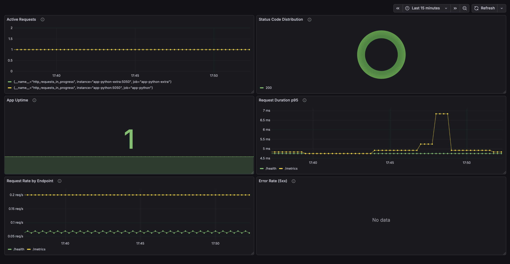

# Lab 8 — Metrics & Monitoring with Prometheus

## Architecture

The complete observability stack now includes both metrics and logs:

```
┌─────────────────┐    ┌──────────────────┐    ┌─────────────────┐
│   Application   │    │    Prometheus    │    │    Grafana      │
│   (metrics)     │────│  (scrape/store)  │────│ (visualize)     │
└─────────────────┘    └──────────────────┘    └─────────────────┘
         │                                              │
         │                                              │
         ▼                                              ▼
┌─────────────────┐    ┌──────────────────┐    ┌─────────────────┐
│   Application   │    │     Promtail     │    │     Loki        │
│    (logs)       │────│  (log collector) │────│ (log storage)   │
└─────────────────┘    └──────────────────┘    └─────────────────┘
```

**Data Flow:**
1. **Metrics Path (RED Method):**
   - Application exposes `/metrics` endpoint with Prometheus format
   - Prometheus scrapes every 15 seconds
   - Data stored in TSDB (Time Series Database)
   - Grafana queries Prometheus using PromQL

2. **Logs Path:**
   - Application writes JSON logs to stdout
   - Promtail collects from Docker containers
   - Loki stores logs with labels
   - Grafana queries using LogQL

**Key Difference:**
- **Metrics (Prometheus):** Tell you *how much* and *how often* (quantitative)
- **Logs (Loki):** Tell you *what happened* (qualitative)

## Application Instrumentation

### Metrics Implemented (RED Method)

| Metric | Type | Labels | Purpose |
|--------|------|--------|---------|
| `http_requests_total` | Counter | method, endpoint, status | Total HTTP requests (Rate + Errors) |
| `http_request_duration_seconds` | Histogram | method, endpoint | Request latency (Duration) |
| `http_requests_in_progress` | Gauge | - | Active concurrent requests |
| `devops_info_endpoint_calls` | Counter | endpoint | Application-specific tracking |
| `devops_info_system_collection_seconds` | Histogram | - | System info collection time |
| `app_uptime_seconds` | Gauge | - | Application uptime |

### Code Implementation

```python
from prometheus_client import Counter, Histogram, Gauge, generate_latest

# Counter: Total HTTP requests
http_requests_total = Counter(
    'http_requests_total',
    'Total HTTP requests',
    ['method', 'endpoint', 'status']
)

# Histogram: Request duration
http_request_duration_seconds = Histogram(
    'http_request_duration_seconds',
    'HTTP request duration in seconds',
    ['method', 'endpoint'],
    buckets=(0.005, 0.01, 0.025, 0.05, 0.1, 0.25, 0.5, 1.0, 2.5, 5.0, 10.0)
)

# Gauge: Active requests
http_requests_in_progress = Gauge(
    'http_requests_in_progress',
    'HTTP requests currently being processed'
)

# Metrics endpoint
@app.route('/metrics')
def metrics():
    return generate_latest(), 200, {'Content-Type': CONTENT_TYPE_LATEST}
```

### Decorator for Automatic Tracking

```python
def track_metrics(f):
    """Decorator to track HTTP request metrics."""
    @functools.wraps(f)
    def wrapped(*args, **kwargs):
        http_requests_in_progress.inc()
        start_time = time.time()
        
        try:
            response = f(*args, **kwargs)
            status_code = response[1] if isinstance(response, tuple) else 200
            
            http_requests_total.labels(
                method=request.method,
                endpoint=request.path,
                status=str(status_code)
            ).inc()
            
            http_request_duration_seconds.labels(
                method=request.method,
                endpoint=request.path
            ).observe(time.time() - start_time)
            
            return response
        finally:
            http_requests_in_progress.dec()
    
    return wrapped

@app.route('/')
@track_metrics
def index():
    # Your endpoint logic
    pass
```

### `/metrics` Output

```
# HELP http_requests_total Total HTTP requests
# TYPE http_requests_total counter
http_requests_total{method="GET",endpoint="/",status="200"} 42.0
http_requests_total{method="GET",endpoint="/health",status="200"} 15.0

# HELP http_request_duration_seconds HTTP request duration in seconds
# TYPE http_request_duration_seconds histogram
http_request_duration_seconds_bucket{le="0.005",method="GET",endpoint="/"} 10.0
http_request_duration_seconds_bucket{le="0.01",method="GET",endpoint="/"} 35.0
http_request_duration_seconds_bucket{le="0.025",method="GET",endpoint="/"} 40.0
http_request_duration_seconds_bucket{le="0.05",method="GET",endpoint="/"} 42.0
http_request_duration_seconds_bucket{le="+Inf",method="GET",endpoint="/"} 42.0
http_request_duration_seconds_sum{method="GET",endpoint="/"} 0.523
http_request_duration_seconds_count{method="GET",endpoint="/"} 42.0

# HELP http_requests_in_progress HTTP requests currently being processed
# TYPE http_requests_in_progress gauge
http_requests_in_progress 0.0

# HELP app_uptime_seconds Application uptime in seconds
# TYPE app_uptime_seconds gauge
app_uptime_seconds 3600.0
```

## Prometheus Configuration

### prometheus.yml

```yaml
global:
  scrape_interval: 15s
  evaluation_interval: 15s

storage:
  tsdb:
    retention_time: 15d
    retention_size: 10GB

scrape_configs:
  - job_name: 'prometheus'
    static_configs:
      - targets: ['localhost:9090']

  - job_name: 'app'
    static_configs:
      - targets: ['app-python:5000']
    metrics_path: '/metrics'

  - job_name: 'loki'
    static_configs:
      - targets: ['loki:3100']

  - job_name: 'grafana'
    static_configs:
      - targets: ['grafana:3000']
```

### Scrape Targets

| Job | Target | Port | Metrics Path |
|-----|--------|------|--------------|
| prometheus | localhost | 9090 | / |
| app | app-python | 5000 | /metrics |
| loki | loki | 3100 | /metrics |
| grafana | grafana | 3000 | /metrics |

## Dashboard Walkthrough

### Panel 1: Request Rate (Graph)

**Purpose:** Shows requests per second by endpoint

**Query:**
```promql
sum by (endpoint) (rate(http_requests_total[5m]))
```

**Explanation:**
- `rate(http_requests_total[5m])` - Calculates per-second rate over 5 minutes
- `sum by (endpoint)` - Aggregates by endpoint label

### Panel 2: Error Rate (Graph)

**Purpose:** Shows 5xx errors per second

**Query:**
```promql
sum(rate(http_requests_total{status=~"5.."}[5m]))
```

**Explanation:**
- `status=~"5.."` - Regex match for 5xx status codes
- Shows when your application is experiencing server errors

### Panel 3: Request Duration p95 (Graph)

**Purpose:** Shows 95th percentile latency

**Query:**
```promql
histogram_quantile(0.95, sum by (le) (rate(http_request_duration_seconds_bucket[5m])))
```

**Explanation:**
- `histogram_quantile(0.95, ...)` - Calculates 95th percentile
- Shows the latency that 95% of requests are below

### Panel 4: Request Duration Heatmap (Heatmap)

**Purpose:** Visualizes latency distribution over time

**Query:**
```promql
sum by (le) (rate(http_request_duration_seconds_bucket[5m]))
```

**Explanation:**
- Shows how request duration is distributed across buckets
- Darker colors indicate more requests in that bucket

### Panel 5: Active Requests (Gauge)

**Purpose:** Shows concurrent requests being processed

**Query:**
```promql
http_requests_in_progress
```

**Explanation:**
- Simple gauge showing current load
- Useful for capacity planning

### Panel 6: Status Code Distribution (Pie Chart)

**Purpose:** Shows ratio of 2xx vs 4xx vs 5xx responses

**Query:**
```promql
sum by (status) (rate(http_requests_total[5m]))
```

**Explanation:**
- Groups requests by status code
- Visual indicator of application health

### Panel 7: Uptime (Stat)

**Purpose:** Shows if service is up

**Query:**
```promql
up{job="app"}
```

**Explanation:**
- Returns 1 if target is up, 0 if down
- Simple health indicator

## PromQL Examples

### Basic Queries

1. **All HTTP requests:**
   ```promql
   http_requests_total
   ```

2. **Filter by method:**
   ```promql
   http_requests_total{method="GET"}
   ```

3. **Filter by endpoint and status:**
   ```promql
   http_requests_total{endpoint="/",status="200"}
   ```

### Rate Calculations

4. **Requests per second:**
   ```promql
   rate(http_requests_total[5m])
   ```

5. **Total requests per second:**
   ```promql
   sum(rate(http_requests_total[5m]))
   ```

6. **Requests per second by endpoint:**
   ```promql
   sum by (endpoint) (rate(http_requests_total[5m]))
   ```

## Application Metrics

### `/metrics` endpoint output

```bash
http://localhost:5050/metrics
```

```bash
# HELP python_gc_objects_collected_total Objects collected during gc
# TYPE python_gc_objects_collected_total counter
python_gc_objects_collected_total{generation="0"} 0.0
python_gc_objects_collected_total{generation="1"} 220.0
python_gc_objects_collected_total{generation="2"} 0.0
# HELP python_gc_objects_uncollectable_total Uncollectable objects found during GC
# TYPE python_gc_objects_uncollectable_total counter
python_gc_objects_uncollectable_total{generation="0"} 0.0
python_gc_objects_uncollectable_total{generation="1"} 0.0
python_gc_objects_uncollectable_total{generation="2"} 0.0
# HELP python_gc_collections_total Number of times this generation was collected
# TYPE python_gc_collections_total counter
python_gc_collections_total{generation="0"} 0.0
python_gc_collections_total{generation="1"} 5.0
python_gc_collections_total{generation="2"} 0.0
# HELP python_info Python platform information
# TYPE python_info gauge
python_info{implementation="CPython",major="3",minor="14",patchlevel="2",version="3.14.2"} 1.0
# HELP http_requests_total Total HTTP requests
# TYPE http_requests_total counter
# HELP http_request_duration_seconds HTTP request duration in seconds
# TYPE http_request_duration_seconds histogram
# HELP http_requests_in_progress Number of HTTP requests currently being processed
# TYPE http_requests_in_progress gauge
http_requests_in_progress 1.0
# HELP devops_info_endpoint_calls_total Number of calls to each endpoint
# TYPE devops_info_endpoint_calls_total counter
devops_info_endpoint_calls_total{endpoint="/metrics"} 1.0
# HELP devops_info_endpoint_calls_created Number of calls to each endpoint
# TYPE devops_info_endpoint_calls_created gauge
devops_info_endpoint_calls_created{endpoint="/metrics"} 1.771246422591667e+09
# HELP devops_info_system_collection_seconds Time taken to collect system information
# TYPE devops_info_system_collection_seconds histogram
devops_info_system_collection_seconds_bucket{le="0.001"} 0.0
devops_info_system_collection_seconds_bucket{le="0.005"} 0.0
devops_info_system_collection_seconds_bucket{le="0.01"} 0.0
devops_info_system_collection_seconds_bucket{le="0.025"} 0.0
devops_info_system_collection_seconds_bucket{le="0.05"} 0.0
devops_info_system_collection_seconds_bucket{le="0.1"} 0.0
devops_info_system_collection_seconds_bucket{le="+Inf"} 0.0
devops_info_system_collection_seconds_count 0.0
devops_info_system_collection_seconds_sum 0.0
# HELP devops_info_system_collection_seconds_created Time taken to collect system information
# TYPE devops_info_system_collection_seconds_created gauge
devops_info_system_collection_seconds_created 1.771246414566783e+09
# HELP process_memory_bytes Memory usage of the Python process in bytes
# TYPE process_memory_bytes gauge
process_memory_bytes 4.2795008e+07
```

### Metric choices

**The RED Method**:

- **Rate** - Requests per second: `rate(http_requests_total[1m])`
- **Errors** - Error rate: `rate(http_requests_total{status=~"5.."}[1m])`
- **Duration** - Response time: `histogram_quantile(0.95, rate(http_request_duration_seconds_bucket[5m]))`

**Reason**:
- The Cover RED method is the basis for monitoring web services
- Minimal cardinality - labels won't blow up Prometheus
- Production-ready - something that is actually used in the industry


## Prometheus Setup

### All targets UP


### PromQL query


## Grafana Dashboards

### Custom application dashboard with live data



## Production Configuration

### `docker compose ps`

```bash
NAME               IMAGE                        COMMAND                  SERVICE            CREATED          STATUS                      PORTS
app-python         info-service-python:latest   "python app.py"          app-python         16 minutes ago   Up 16 minutes (healthy)     0.0.0.0:8000->5050/tcp
app-python-extra   info-service-python:latest   "python app.py"          app-python-extra   16 minutes ago   Up 16 minutes (healthy)     0.0.0.0:8001->5050/tcp
grafana            grafana/grafana:12.3.1       "/run.sh"                grafana            16 minutes ago   Up 16 minutes (healthy)     0.0.0.0:3000->3000/tcp
loki               grafana/loki:3.0.0           "/usr/bin/loki -conf…"   loki               16 minutes ago   Up 16 minutes (healthy)     0.0.0.0:3100->3100/tcp
prometheus         prom/prometheus:v3.9.0       "/bin/prometheus --c…"   prometheus         16 minutes ago   Up 16 minutes (healthy)     0.0.0.0:9090->9090/tcp
promtail           grafana/promtail:3.0.0       "/usr/bin/promtail -…"   promtail           16 minutes ago   Up 16 minutes (healthy)   0.0.0.0:9080->9080/tcp
```

### Retention policies

**Prometheus**:
- Time-based retention: 15 days
- Size-based retention: 10GB
- Configured via command line flags:
  - `--storage.tsdb.retention.time=15d`
  - `--storage.tsdb.retention.size=10GB`

**Loki**:
- Time-based retention: 7 days (168 hours)
- Configured in `loki/config.yml`:
  ```yaml
  limits_config:
    retention_period: 168h
  ```


## Ansible playbook execution

```bash
ansible-playbook -i inventory/hosts.ini playbooks/deploy-monitoring.yml
```

```bash
PLAY [Deploy Complete Observability Stack] *****************************************************************************************************************************

TASK [Gathering Facts] ******************************************************************************************************************************************
ok: [info-service]

TASK [Display deployment info] **********************************************************************************************************************************
ok: [info-service] => {
    "msg": "========================================\nDeploying Monitoring Stack\nLoki: 3.0.0\nGrafana: 12.3.1\nRetention: 168h\n========================================\n"
}

TASK [docker : Include cleanup tasks] ***************************************************************************************************************************
included: /Users/can4red/Aleksandr-Isupov-DevOps-Core-Course/ansible/roles/docker/tasks/cleanup.yml for info-service

TASK [docker : Remove all Docker repository files] **************************************************************************************************************
ok: [info-service] => (item=/etc/apt/sources.list.d/docker.list)
ok: [info-service] => (item=/etc/apt/sources.list.d/additional-repositories.list)
ok: [info-service] => (item=/etc/apt/keyrings/docker.gpg)
ok: [info-service] => (item=/etc/apt/keyrings/docker.asc)
ok: [info-service] => (item=/usr/share/keyrings/docker.gpg)
ok: [info-service] => (item=/etc/apt/trusted.gpg.d/docker.gpg)
ok: [info-service] => (item=/etc/apt/trusted.gpg.d/docker-archive-keyring.gpg)
ok: [info-service] => (item=/etc/apt/trusted.gpg.d/docker-ce.gpg)

TASK [docker : Remove any Docker repository from sources.list] **************************************************************************************************
ok: [info-service]

TASK [docker : Remove any Docker repository from sources.list.d] ************************************************************************************************
ok: [info-service]

TASK [docker : Clean apt cache] *********************************************************************************************************************************
ok: [info-service]

TASK [docker : Update apt cache] ********************************************************************************************************************************
changed: [info-service]

TASK [docker : Create keyrings directory] ***********************************************************************************************************************
ok: [info-service]

TASK [docker : Install Docker prerequisites] ********************************************************************************************************************
ok: [info-service]

TASK [docker : Add Docker GPG key] ******************************************************************************************************************************
ok: [info-service]

TASK [docker : Add Docker repository] ***************************************************************************************************************************
ok: [info-service]

TASK [docker : Update apt cache after repository setup] *********************************************************************************************************
changed: [info-service]

TASK [docker : Install Docker packages] *************************************************************************************************************************
ok: [info-service]

TASK [docker : Ensure pip is up to date] ************************************************************************************************************************
ok: [info-service]

TASK [docker : Install Docker Python SDK] ***********************************************************************************************************************
ok: [info-service]

TASK [docker : Start and enable Docker service] *****************************************************************************************************************
ok: [info-service]

TASK [docker : Wait for Docker to be ready] *********************************************************************************************************************
ok: [info-service]

TASK [docker : Add users to docker group] ***********************************************************************************************************************
ok: [info-service] => (item=ubuntu)
ok: [info-service] => (item=appuser)

TASK [docker : Create docker-compose directory] *****************************************************************************************************************
ok: [info-service]

TASK [docker : Verify Docker installation] **********************************************************************************************************************
ok: [info-service]

TASK [docker : Display Docker version] **************************************************************************************************************************
ok: [info-service] => {
    "msg": "Docker version: Docker version 29.2.1, build a5c7197"
}

TASK [common : Update apt cache] ********************************************************************************************************************************
ok: [info-service]

TASK [common : Install common packages] *************************************************************************************************************************
ok: [info-service]

TASK [common : Upgrade system packages] *************************************************************************************************************************
skipping: [info-service]

TASK [common : Log package installation completion] *************************************************************************************************************
ok: [info-service] => {
    "msg": "Package installation block completed"
}

TASK [common : Create completion timestamp] *********************************************************************************************************************
changed: [info-service]

TASK [common : Create application user] *************************************************************************************************************************
ok: [info-service]

TASK [common : Ensure SSH directory exists for app user] ********************************************************************************************************
ok: [info-service]

TASK [common : Add users to sudo group] *************************************************************************************************************************
skipping: [info-service]

TASK [common : User management completed] ***********************************************************************************************************************
ok: [info-service] => {
    "msg": "User management block finished"
}

TASK [common : Set timezone] ************************************************************************************************************************************
ok: [info-service]

TASK [common : Configure hostname] ******************************************************************************************************************************
ok: [info-service]

TASK [common : Configure SSH hardening] *************************************************************************************************************************
ok: [info-service] => (item={'key': 'PasswordAuthentication', 'value': 'no'})
ok: [info-service] => (item={'key': 'PermitRootLogin', 'value': 'no'})
ok: [info-service] => (item={'key': 'ClientAliveInterval', 'value': '300'})

TASK [monitoring : Include setup tasks] *************************************************************************************************************************
included: /Users/can4red/Aleksandr-Isupov-DevOps-Core-Course/ansible/roles/monitoring/tasks/setup.yml for info-service

TASK [monitoring : Create monitoring directories] ***************************************************************************************************************
ok: [info-service] => (item=/opt/monitoring)
ok: [info-service] => (item=/opt/monitoring/loki)
ok: [info-service] => (item=/opt/monitoring/promtail)
ok: [info-service] => (item=/var/lib/monitoring)

TASK [monitoring : Remove Loki config if it is a directory] *****************************************************************************************************
changed: [info-service]

TASK [monitoring : Template Loki configuration] *****************************************************************************************************************
changed: [info-service]

TASK [monitoring : Template Promtail configuration] *************************************************************************************************************
ok: [info-service]

TASK [monitoring : Template Docker Compose file] ****************************************************************************************************************
ok: [info-service]

TASK [monitoring : Login to Docker Hub] *************************************************************************************************************************
skipping: [info-service]

TASK [monitoring : Include deploy tasks] ************************************************************************************************************************
included: /Users/can4red/Aleksandr-Isupov-DevOps-Core-Course/ansible/roles/monitoring/tasks/deploy.yml for info-service

TASK [monitoring : Deploy monitoring stack with Docker Compose] *************************************************************************************************
ok: [info-service]

TASK [monitoring : Display compose result] **********************************************************************************************************************
ok: [info-service] => {
    "msg": "Stack deployed: []"
}

TASK [monitoring : Wait for Loki to be ready] *******************************************************************************************************************
ok: [info-service]

TASK [monitoring : Wait for Promtail to be ready] ***************************************************************************************************************
ok: [info-service]

TASK [monitoring : Wait for Grafana to be ready] ****************************************************************************************************************
ok: [info-service]

TASK [monitoring : Wait for Prometheus to be ready] ************************************************************************************************************
changed: [info-service]

TASK [monitoring : Wait for Python apps to be ready] ************************************************************************************************************
ok: [info-service]

PLAY RECAP ******************************************************************************************************************************************************
info-service               : ok=46   changed=6    unreachable=0    failed=0    skipped=3    rescued=0    ignored=0  
```bash

```


## Idempotency

```bash
ansible-playbook -i inventory/hosts.ini playbooks/deploy-monitoring.yml
```

```bash
PLAY [Deploy Complete Observability Stack] *****************************************************************************************************************************

TASK [Gathering Facts] ******************************************************************************************************************************************
ok: [info-service]

TASK [Display deployment info] **********************************************************************************************************************************
ok: [info-service] => {
    "msg": "========================================\nDeploying Monitoring Stack\nLoki: 3.0.0\nGrafana: 12.3.1\nRetention: 168h\n========================================\n"
}

TASK [docker : Include cleanup tasks] ***************************************************************************************************************************
included: /Users/can4red/Aleksandr-Isupov-DevOps-Core-Course/ansible/roles/docker/tasks/cleanup.yml for info-service

TASK [docker : Remove all Docker repository files] **************************************************************************************************************
ok: [info-service] => (item=/etc/apt/sources.list.d/docker.list)
ok: [info-service] => (item=/etc/apt/sources.list.d/additional-repositories.list)
ok: [info-service] => (item=/etc/apt/keyrings/docker.gpg)
ok: [info-service] => (item=/etc/apt/keyrings/docker.asc)
ok: [info-service] => (item=/usr/share/keyrings/docker.gpg)
ok: [info-service] => (item=/etc/apt/trusted.gpg.d/docker.gpg)
ok: [info-service] => (item=/etc/apt/trusted.gpg.d/docker-archive-keyring.gpg)
ok: [info-service] => (item=/etc/apt/trusted.gpg.d/docker-ce.gpg)

TASK [docker : Remove any Docker repository from sources.list] **************************************************************************************************
ok: [info-service]

TASK [docker : Remove any Docker repository from sources.list.d] ************************************************************************************************
ok: [info-service]

TASK [docker : Clean apt cache] *********************************************************************************************************************************
ok: [info-service]

TASK [docker : Update apt cache] ********************************************************************************************************************************
changed: [info-service]

TASK [docker : Create keyrings directory] ***********************************************************************************************************************
ok: [info-service]

TASK [docker : Install Docker prerequisites] ********************************************************************************************************************
ok: [info-service]

TASK [docker : Add Docker GPG key] ******************************************************************************************************************************
ok: [info-service]

TASK [docker : Add Docker repository] ***************************************************************************************************************************
ok: [info-service]

TASK [docker : Update apt cache after repository setup] *********************************************************************************************************
changed: [info-service]

TASK [docker : Install Docker packages] *************************************************************************************************************************
ok: [info-service]

TASK [docker : Ensure pip is up to date] ************************************************************************************************************************
ok: [info-service]

TASK [docker : Install Docker Python SDK] ***********************************************************************************************************************
ok: [info-service]

TASK [docker : Start and enable Docker service] *****************************************************************************************************************
ok: [info-service]

TASK [docker : Wait for Docker to be ready] *********************************************************************************************************************
ok: [info-service]

TASK [docker : Add users to docker group] ***********************************************************************************************************************
ok: [info-service] => (item=ubuntu)
ok: [info-service] => (item=appuser)

TASK [docker : Create docker-compose directory] *****************************************************************************************************************
ok: [info-service]

TASK [docker : Verify Docker installation] **********************************************************************************************************************
ok: [info-service]

TASK [docker : Display Docker version] **************************************************************************************************************************
ok: [info-service] => {
    "msg": "Docker version: Docker version 29.2.1, build a5c7197"
}

TASK [common : Update apt cache] ********************************************************************************************************************************
ok: [info-service]

TASK [common : Install common packages] *************************************************************************************************************************
ok: [info-service]

TASK [common : Upgrade system packages] *************************************************************************************************************************
skipping: [info-service]

TASK [common : Log package installation completion] *************************************************************************************************************
ok: [info-service] => {
    "msg": "Package installation block completed"
}

TASK [common : Create completion timestamp] *********************************************************************************************************************
changed: [info-service]

TASK [common : Create application user] *************************************************************************************************************************
ok: [info-service]

TASK [common : Ensure SSH directory exists for app user] ********************************************************************************************************
ok: [info-service]

TASK [common : Add users to sudo group] *************************************************************************************************************************
skipping: [info-service]

TASK [common : User management completed] ***********************************************************************************************************************
ok: [info-service] => {
    "msg": "User management block finished"
}

TASK [common : Set timezone] ************************************************************************************************************************************
ok: [info-service]

TASK [common : Configure hostname] ******************************************************************************************************************************
ok: [info-service]

TASK [common : Configure SSH hardening] *************************************************************************************************************************
ok: [info-service] => (item={'key': 'PasswordAuthentication', 'value': 'no'})
ok: [info-service] => (item={'key': 'PermitRootLogin', 'value': 'no'})
ok: [info-service] => (item={'key': 'ClientAliveInterval', 'value': '300'})

TASK [monitoring : Include setup tasks] *************************************************************************************************************************
included: /Users/can4red/Aleksandr-Isupov-DevOps-Core-Course/ansible/roles/monitoring/tasks/setup.yml for info-service

TASK [monitoring : Create monitoring directories] ***************************************************************************************************************
ok: [info-service] => (item=/opt/monitoring)
ok: [info-service] => (item=/opt/monitoring/loki)
ok: [info-service] => (item=/opt/monitoring/promtail)
ok: [info-service] => (item=/var/lib/monitoring)

TASK [monitoring : Remove Loki config if it is a directory] *****************************************************************************************************
changed: [info-service]

TASK [monitoring : Template Loki configuration] *****************************************************************************************************************
changed: [info-service]

TASK [monitoring : Template Promtail configuration] *************************************************************************************************************
ok: [info-service]

TASK [monitoring : Template Docker Compose file] ****************************************************************************************************************
ok: [info-service]

TASK [monitoring : Login to Docker Hub] *************************************************************************************************************************
skipping: [info-service]

TASK [monitoring : Include deploy tasks] ************************************************************************************************************************
included: /Users/can4red/Aleksandr-Isupov-DevOps-Core-Course/ansible/roles/monitoring/tasks/deploy.yml for info-service

TASK [monitoring : Deploy monitoring stack with Docker Compose] *************************************************************************************************
ok: [info-service]

TASK [monitoring : Display compose result] **********************************************************************************************************************
ok: [info-service] => {
    "msg": "Stack deployed: []"
}

TASK [monitoring : Wait for Loki to be ready] *******************************************************************************************************************
ok: [info-service]

TASK [monitoring : Wait for Promtail to be ready] ***************************************************************************************************************
ok: [info-service]

TASK [monitoring : Wait for Grafana to be ready] ****************************************************************************************************************
ok: [info-service]

TASK [monitoring : Wait for Prometheus to be ready] ************************************************************************************************************
ok: [info-service]

TASK [monitoring : Wait for Python apps to be ready] ************************************************************************************************************
ok: [info-service]

PLAY RECAP ******************************************************************************************************************************************************
info-service               : ok=46   changed=5    unreachable=0    failed=0    skipped=3    rescued=0    ignored=0
